# Neighborhoods and Settlements

## Bayou Outpost

<geotag 
  latitude=29.762520842934414
  longitude=-95.39266304824955
  icon="LARGE_SETTLEMENT"
  name="Bayou Outpost"
/>

|                                         |                   |
|-----------------------------------------|-------------------|
| **Population**                          | 30                |
| **Defenses**                            | Very Strong       |
| **Food Supply**                         | Abundant          |
| **Denizen Outlook**                     | Friendly          |
| **Faction Affiliation**                 | Bayou Brotherhood |
| **Starting Settlement Reputation Rank** | Neutral (2)       |

- The Bayou Outpost, a medium-sized settlement, is the Bayou Brotherhood's primary base of operations. It is located in the remains of the pre-war Buffalo Bayou Park, a former urban park Northeast of Downtown Houston. The bayou has reclaimed much of the park, turning it into a lush wetland.
- The settlement is situated around the Montrose Blvd overpass above the Buffalo Bayou. The Brotherhood has fortified the overpass and surrounding area, turning it into a defensible position. The bayou has reclaimed not just the strip of land around the river, but also the area north, encompassing the area around a secluded apartment complex on the west of Montrose Blvd and a small tower + pool complex on the east of Montrose Blvd.
- The tower is intentionally kept in a state of disrepair to avoid drawing the attention of outsiders, but acts as both a lookout post and as an easy landmark for members of the Brotherhood who canoe up and down the Bayou.
- The settlement's architecture consists of a combination of salvaged metal structures, wooden shanties, and makeshift walkways built on stilts to keep above the water and muck. Structures are often covered with moss and algae, giving them a weathered and camouflaged appearance. The entire settlement is surrounded by tall, twisted trees and dense, waterlogged foliage, making it difficult to spot from a distance, especially since the entire area is receded below the surrounding terrain and a thick fog often covers the area. As the settlement has grown, some residents have opted to repair parts of the apartment complex, but most of the settlement is still built on or around the river.
- The primary challenge for the inhabitants is dealing with periodic flooding caused by the rising and receding water levels of the swamp. Many structures have built-in drainage systems, and the settlers have become experts in managing water flow.
- Food is plentiful, with the bayou providing a variety of fish, crustaceans, and other wildlife. The settlers also cultivate crops in small hydroponic gardens and collect rainwater for drinking and cooking.
- There are about 30 people living in the settlement, including a few children. The settlers are a tight-knit community, and everyone contributes to the settlement's survival. They are wary of outsiders but are willing to trade with those who prove themselves trustworthy.
- The Bayou Outpost is led by Cyrus "Gator" Thibodeaux, a charismatic leader who is well-respected by the settlers. He is a former fisherman who has lived in the bayou his entire life and is an expert in navigating the swamp's treacherous waters. He is also a skilled hunter and fisherman, providing food for the settlement.
- A council of 4 elders assists Gator in making decisions for the community. The council is made up of the settlement's most experienced and respected members, including the Swamp Sage, a spiritual leader who guides the community in spiritual practices and rituals.

For more information about the surrounding Bayou, see [The Bayous and Wetlands](#the-bayous-and-wetlands).

### Notable Locations

#### Montrose Overpass and the Bayou Bazaar

The heart of the Bayou Outpost is the Montrose overpass. This elevated structure, fortified by the Bayou Brotherhood, serves as the main hub of the settlement. It offers a commanding view of the surrounding bayou and is equipped with guard posts, lookout towers, and houses the Bayou Bazaar. At the center of the overpass is a large open area that serves as a communal gathering space for the settlers.

The Bayou Bazaar is the heart of the Bayou Outpost's trading and commerce. It's a bustling area where settlers, traders, and scavengers gather to exchange goods, resources, and stories.

- Stalls and Shacks: Various makeshift stalls and shanties line the wooden walkways above the swamp water, creating a vibrant marketplace. These structures are crafted from salvaged materials and display a variety of wares, from scavenged pre-war technology to mutated wildlife pelts and exotic bayou herbs.
- Trade Hub: The Bayou Bazaar is the central hub for trade and commerce within the settlement. Residents trade surplus food, weapons, and scavenged items in exchange for essentials like purified water, tools, and other valuable goods. The barter system is prevalent, and a sense of trust is vital in these transactions.
- Entertainment and Social Hub: In the evenings, the Bayou Bazaar transforms into an entertainment and social hub. Settlers gather to share stories, music, and dance, strengthening their community bonds and offering moments of respite in the harsh wasteland.
- The Waterfront: The market extends over the swamp waters, with platforms and shacks built on stilts. This unique feature allows traders to arrive by boat or canoe, expanding the trading network and providing the settlement access to goods from the broader bayou region.

The Bayou Outpost has its own unique calendar of cultural celebrations and rituals. These events often revolve around the changing seasons, the bayou's natural cycles, and the spiritual beliefs of the Swamp Sage. Residents gather to partake in dances, music, and storytelling during these special occasions.

#### Bayou Meadow Apartments

Named after a street sign found in the complex. On the west side of Montrose Blvd, nestled among the thick trees and marshy terrain, stands a once-secluded apartment complex. Some resourceful settlers have taken up residence here, meticulously repairing and fortifying their living spaces. The apartments serve as additional housing for the community that has outgrown its shanty-town origins, and they offer a stark contrast to the rest of the outpost, where most structures are built on or around the bayou.

#### Windsor Tower and Pool
Located on the east side of Montrose Blvd, a tall tower that appears dilapidated at first glance is another key landmark of the Bayou Outpost. Though it is intentionally left in a state of disrepair to avoid drawing unwanted attention, the tower serves as a lookout post for potential threats and a landmark for Bayou Brotherhood members navigating the bayou. A small, repurposed pool complex adjacent to the tower provides a source of cleaner water for growing some hydroponic crops.

#### The Hydroponic Gardens
To ensure a sustainable source of food, the settlers have established hydroponic gardens on the stilts and walkways that crisscross the swampy terrain. These gardens yield various crops, including irradiated ferns and mutated water lilies. These hydroponic gardens are a testament to the settlers' adaptability and resourcefulness.

#### The Gator's Den
Cyrus "Gator" Thibodeaux's personal quarters, known as "The Gator's Den," are a collection of interconnected shanties perched on stilts near the heart of the outpost, directly underneath the Overpass. This is where the settlement's leader plans and strategizes. His living space is adorned with trophies from his hunting and fishing endeavors, showcasing his prowess as a provider for the community.

#### Hydroelectric Generator
To harness the power of the bayou, the settlers have rigged a makeshift hydroelectric generator, located beneath the Montrose Overpass. This generator provides electricity for essential systems like lighting, water pumps, and communication equipment. Additional generators have been installed up and down the bayou, with power lines connecting them to the main generator.

#### Swampside Infimary
Positioned on the southside of the settlement, just off the Overpass and near the southern shore, the Swampside Infirmary is a modest, but vital structure where the outpost's only medic tends to the health needs of the residents. The infirmary is situated on stilts and is surrounded by various medicinal plants and herbs, carefully tended to by the settlement's healer. Inside, the small medical hut is well-organized, housing essential medical supplies salvaged from the wasteland.

- Healing Services: The settlement's medic, a skilled and compassionate individual, provides a range of medical services, including treating injuries, illnesses, and radiation exposure. They are also skilled in using natural remedies found in the bayou, making use of the local flora to create healing concoctions.
- Hydroponic Medical Garden: Adjacent to the medical hut is a hydroponic garden dedicated to growing medicinal herbs and plants. These are used to create poultices, tinctures, and other remedies, providing a renewable source of healing resources for the community.
- Quarantine Area: A section of the medical hut is set aside for isolating and treating individuals with contagious diseases or radiation poisoning, ensuring the well-being of the settlement remains a top priority.

#### Lower Residences/Montrose Quarters
Beneath the Montrose Blvd overpass, the Lower Residences, often referred to as Montrose Quarters, consist of a series of living spaces and shanties constructed on the ground level of the settlement, right below the elevated structure.

The majority of the settlement's residents, including families and individuals, reside in the Montrose Quarters. It is home to about two-thirds of the Bayou Outpost's population, making it a bustling and vibrant community. The Lower Residences are characterized by their tight-knit nature, with neighbors offering mutual support and a strong sense of camaraderie.

Despite the harsh and rustic appearance of the Lower Residences, the settlers have made these spaces as comfortable as possible. Each dwelling is equipped with salvaged furniture, sleeping quarters, and storage for personal belongings. Many residents have personalized their living spaces with unique touches that reflect their individual personalities and histories.

#### Swamp Ritual Grove

Nestled deep within the bayou, hidden away from the daily life of the settlement, is the Swamp Ritual Grove. This secluded area is known only to a select few in the Bayou Outpost, and it serves as a sacred space for spiritual and mystical rituals.

The Ritual Grove is an oasis of tranquility within the wild and unpredictable bayou. It is an open, natural clearing surrounded by ancient, towering cypress trees, their roots partly submerged in the dark, still waters of the bayou. Thick, hanging moss drapes from the branches, creating an otherworldly atmosphere.

In the center of the clearing, there's a simple shrine dedicated to the bayou's guardian spirits. The shrine is adorned with offerings like colorful beads, feathers, and small trinkets left by those who come to seek the Swamp Sage's guidance. Nearby, a stone altar is used for conducting various rituals and ceremonies. It's often covered with candles, herbs, and symbols representing the bayou's natural elements.

The Swamp Sage, a wise and revered figure within the settlement, leads the community in spiritual practices and offers guidance in times of need. The Swamp Sage, often adorned with robes and amulets made from bayou materials, conducts ceremonies, chants, and dances to communicate with the spirits and seek their blessings.

Surrounding the clearing are carefully tended herb gardens, containing rare and mystical flora believed to have special properties. These herbs play a significant role in the rituals and are harvested to create potions, remedies, and protective charms.

The Swamp Sage Ritual Grove is also a repository for ancient artifacts and knowledge passed down through generations. Weathered books, scrolls, and relics related to the bayou's spiritual history are stored here, preserving the community's connection to the past.

### Quests

#### Side Quest: Swamp Spirits' Fury
!!! info ""

    This quest becomes available after completing [Main Quest: Lost in the Bayou](../../Story/Act1/Quest1.md), so long as the players' Bayou Outpost settlement reputation is at least Cautious (rank 1).
    
    **Add 1 AP per PC to the GM's pool when the quest begins.**

*Quest Giver: Swamp Sage*

The Swamp Sage believes the bayou's spirits have been angered due to recent disturbances. The players are tasked with investigating strange occurrences, like the unexplained intensification of the fog, the aggression of the local wildlife, and a sudden increase in flooding. The quest leads the players to uncover a hidden group of outsiders who have been irresponsibly mining and polluting the bayou upstream. The players must confront the outsiders, halt their activities, and restore harmony with the swamp spirits.

#### Side Quest: The Lost Relic
!!! info ""

    This quest becomes available as soon as the players enter the Montrose Overpass for the first time in [Main Quest: Lost in the Bayou](../../Story/Act1/Quest1.md), if they approach the young settler in the Bayou Bazaar. If after completing [Main Quest: Lost in the Bayou](../../Story/Act1/Quest1.md) the players have not yet completed this quest, then the young Settler will approach the players and ask for their help at some future time they are in the Bayou Outpost.

*Quest Giver: A Young Settler*

A young member of the Bayou Outpost has lost a family heirloom – a treasured necklace believed to hold protective properties. The necklace went missing during a recent flood, and the settlers suspect it may have been carried downstream. The players must embark on a journey through the bayou's treacherous waters to recover the lost relic. Along the way, they will face challenges, including dealing with dangerous mutated creatures and helping other settlers in need.

#### Side Quest: Cyrus's Call
!!! info ""

    This quest becomes available after completing [Main Quest: Lost in the Bayou](../../Story/Act1/Quest1.md), so long as the players' Bayou Outpost settlement reputation is at least Cautious (rank 1).
    
    **Add 1 AP per PC to the GM's pool when the quest begins.**

*Quest Giver: Cyrus "Gator" Boudreaux*

The settlement's leader, Cyrus "Gator" Boudreaux, needs the players' help in locating a missing scout who went on a crucial mission but hasn't returned. The scout was last seen investigating a Raider Encampment that posed a potential threat to the Bayou Outpost. Players must navigate the bayou's waterways, uncover the fate of the missing scout, and gather intelligence on the rival settlement. This quest may involve diplomacy, stealth, or combat, depending on the situation players encounter.

#### Side Quest: Tales of the Swamp

!!! info ""

    This quest becomes available as soon as the players enter the Montrose Overpass for the first time in [Main Quest: Lost in the Bayou](../../Story/Act1/Quest1.md), if they approach the elderly settler in the Bayou Bazaar.

*Quest Giver: An Elderly Settler*

An elderly settler, the outpost's historian and storyteller, wants the players to collect stories and artifacts from the bayou's hidden corners to preserve the community's history and traditions. The quest involves exploring the swamp's most remote and enigmatic locations, interacting with unique characters and creatures, and piecing together the oral history of the Bayou Brotherhood. Along the way, players may uncover forgotten secrets, folklore, and valuable relics that shed light on the bayou's mysteries.

#### Side Quest: Outsider Diplomacy

!!! info ""

    This quest becomes available after completing [Main Quest: Lost in the Bayou](../../Story/Act1/Quest1.md), so long as the players' Bayou Outpost settlement reputation is at least Trusting (rank 4).
    
    **Add 1 AP per PC to the GM's pool when the quest begins.**

*Quest Giver: Settlement Council Elder or Cyrus "Gator" Boudreaux*

The council of elders at the Bayou Outpost has decided that it's time to establish formal diplomatic relations with a neighboring settlement to improve trade and security. The players are chosen as envoys and must venture to the nearby settlement to negotiate an agreement. However, they quickly discover that the rival settlement has its own challenges and conflicts. Players must navigate a web of diplomacy, make important decisions, and find ways to build trust between the two communities, all while facing moral dilemmas that may impact the bayou's future.

##### The Fallout
The PC with the highest Charisma makes a settlement reputation test **(CHA + Reputation Rank)** when the quest resolves, rolling a number of d20s equal to their positive influences against a difficulty equal to the number of negative influences. Use the following outcomes as a guide:

- **Peacefully negotiated formal agreement:** If the PCs convince the rival settlement to sign a formal agreement, the Bayou Outpost gains a new trade partner and a boost to its reputation. The Bayou Outpost's settlement reputation increases by 1 rank, and the players gain 1 AP. The shops at the Bayou Bazaar will have a wider variety of goods available for purchase, and the players will have access to a new shop at the other settlement. The players may also gain a new ally in the other settlement. Members of the other settlement may occasionally be seen at the Bayou Bazaar, and Brotherhood members may occasionally be found in the other settlement.
- **Peacefully negotiated informal agreement, but failed to negotiate trading contract or diplomatic relations:** If the PCs convince the rival settlement to agree to an informal arrangement, then the results of such an arrangement will be visible in the future. If the agreement is substatial, then the Bayou Outpost's settlement reputation may increase by 1 rank
- **Instigated tensions with the rival settlement:** If the PCs instigated tensions with the rival settlement, then the Bayou Outpost's settlement reputation decreases by 1 rank. The rival settlement may occasionally send raiding parties to the Bayou Outpost, and the Bayou Outpost may occasionally send raiding parties to the rival settlement. The Bayou Outpost may call upon the players to help defend them in the future.
- **Negotiated unfavorable terms:** If the PCs negotiate unfavorable terms for the Bayou Outpost, then the Bayou Outpost's settlement reputation decreases by 1 rank. Whatever the result of the agreement is will be visible in future visits to the Outpost or to the other settlement.
- **Betrayed the Bayou Brotherhood:** If the PCs side with the rival settlement and betray the Bayou Brotherhood (leading to the rival settlement's attack on the Outpost), then the Bayou Outpost's settlement reputation instantly drops to 0 (Hostile). If the attack succesfully destroys or conquers the Outpost, then the Bayou Brotherhood members scatter across the Bayou and may attack the Player on sight in the future.

## Downtown Houston

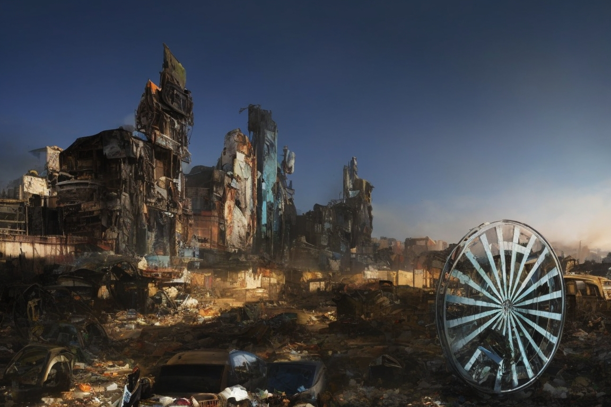

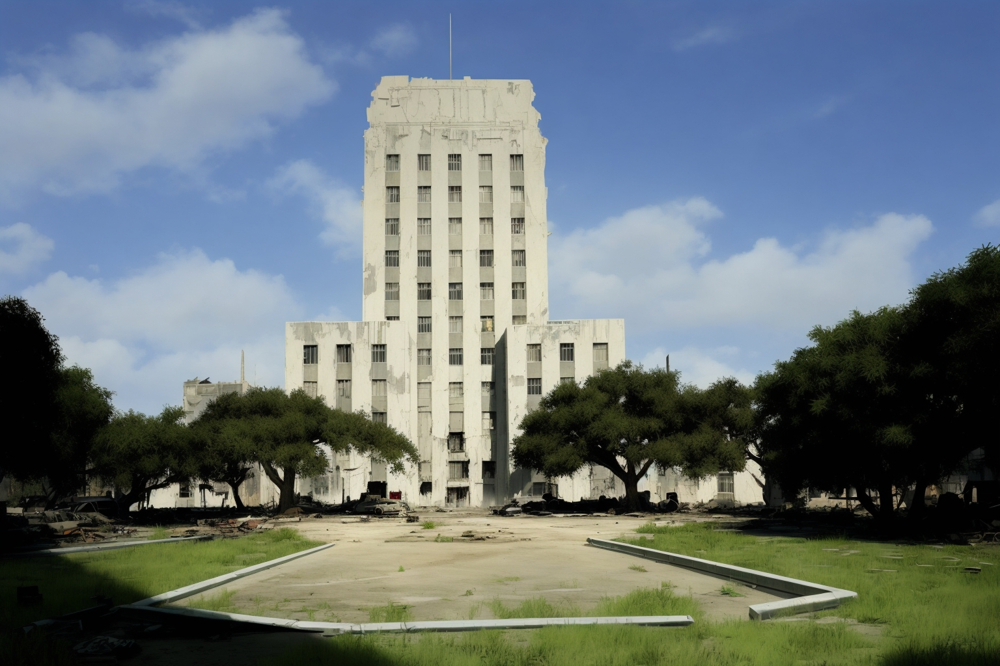

<geotag 
  latitude=29.759460655823844
  longitude=-95.36803566374721
  icon="CITY"
  name="Downtown Houston"
/>

- Downtown Houston, once a thriving hub of commerce and culture, now lies in ruin. The towering skyscrapers that once
  defined the cityscape have crumbled into skeletal structures, and the streets are filled with debris and remnants of
  pre-war life.
- The area is perilous, with irradiated zones, mutated creatures, and desperate survivors who eke out a hardscrabble
  existence among the wreckage. Some have set up makeshift camps within the former corporate offices, but constant
  threats make this a dangerous place to reside.
- The Lone Star Republic patrols the outskirts of downtown, attempting to secure valuable resources and prevent hostile
  factions from gaining a foothold in this devastated urban center.
- Beneath the crumbling skyscrapers of downtown, scavengers and survivors have formed small, tight-knit communities in
  the remnants of corporate offices. These communities often rely on rooftop gardens and rainwater collection to sustain
  themselves.
- The Lone Star Republic maintains an uneasy presence on the outskirts of downtown, occasionally venturing into the
  perilous heart of the district to recover valuable pre-war technology and documents hidden within the ruins.
- Deep within the downtown district, rumors persist of a hidden underground network of tunnels that once served as an
  escape route for wealthy executives. These tunnels are said to contain caches of valuable resources and secrets,
  making them a coveted prize for daring adventurers.

## The Heights

<geotag 
  latitude=29.798385570901733
  longitude=-95.39802007903164
  icon=""
  name="The Heights"
/>
- The Heights, known for its historic bungalow-style houses, has seen better days. Many of the homes have fallen into
  disrepair or lie in ruins, their once-charming facades marred by time and neglect.
- Survivors in The Heights have repurposed some of the buildings for shelter, transforming them into makeshift homes and
  communal spaces. Despite the challenges of this post-apocalyptic life, a sense of community and resilience persists
  among the residents.
- The Lone Star Republic maintains a presence in The Heights, working to secure vital resources and maintain order among
  the survivors. They have established checkpoints and supply depots to support their operations.

## Third Ward

<geotag 
  latitude=29.7243844
  longitude=-95.359051
  icon=""
  name="Third Ward"
/>

- The Third Ward, a predominantly African American neighborhood with a rich cultural history, has become a hub for
  cultural preservation. Survivors here have worked diligently to maintain their heritage through art, music, and
  storytelling.
- The neighborhood's streets are adorned with vibrant murals and communal gathering spaces, and residents are known for
  their artistic expressions. Despite the challenges of the wasteland, the Third Ward serves as a beacon of hope and
  cultural identity.
- The Bayou Brotherhood, drawn to the area's spiritual significance, has a presence in the Third Ward. Their mystics
  believe that the nearby bayous hold mystical and cosmic connections, making this neighborhood a site of importance for
  their rituals and gatherings.

## East End

<geotag 
  latitude=29.7360857
  longitude=-95.3060972
  icon="FACTORY"
  name="East End"
/>

- The East End, once an industrial and shipping hub, has experienced renewed activity in the post-apocalyptic era.
  Abandoned warehouses and factories have been repurposed for various uses, from shelter to workshops.
- The area has become a hotbed of conflict, as factions like the Galveston Pirates vie for control of ports along the
  coast. Some survivors in this neighborhood have turned to piracy or smuggling to survive, while others seek refuge in
  the Lone Star Republic's settlements for protection from the pirates.
- The East End's strategic location makes it a key battleground in the ongoing struggle for dominance over sea routes
  and trade in the region.

## Montrose

<geotag 
  latitude=29.74687555
  longitude=-95.39730335255877
  icon=""
  name="Montrose"
/>

- Montrose, a district known for its vibrant arts and cultural scene in the pre-war era, has transformed into a bustling
  marketplace in the post-apocalyptic wasteland. Its streets are lined with makeshift market stalls, and traders from
  various factions hawk their wares.
- The Lone Star Republic maintains a significant presence in Montrose, using it as a base for intelligence gathering and
  reconnaissance. The area serves as a key observation point for monitoring the activities of rival factions and
  safeguarding critical resources.
- The New Liberty Trading Company (NLTC) has established a significant presence in Montrose, facilitating trade between
  the Gulf Coast Wasteland's diverse factions. Caravans and trading posts run by NLTC are common sights in this area,
  turning it into a crucial hub for economic activity.
- Despite the challenges of the wasteland, Montrose remains a place where survivors come to trade, barter, and exchange
  stories, keeping a semblance of commerce and culture alive in this harsh world.

## Rice Village

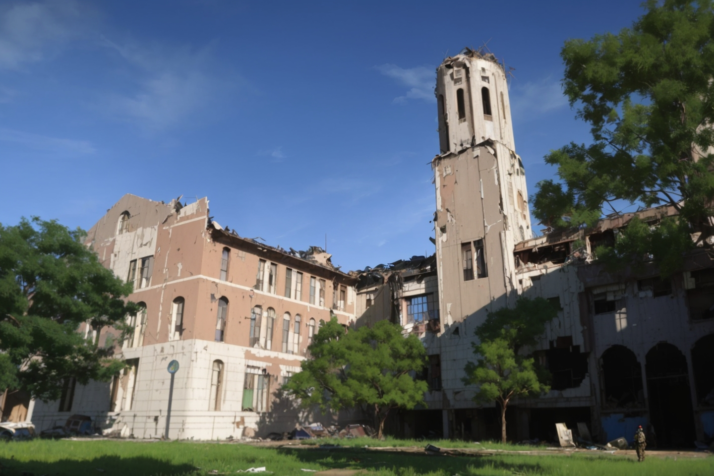

<geotag 
  latitude=29.716345888623884
  longitude=-95.41241903384515
  icon="GOVERNMENT"
  name="Rice Village"
/>

- Rice Village, known for its upscale shopping and dining options in the pre-war era, has undergone a stark
  transformation. Many of the once-elegant shops and restaurants now lie in ruins, their windows shattered and interiors
  ransacked.
- Survivors in Rice Village have repurposed abandoned storefronts as trading posts and gathering places. The district
  has become a bustling marketplace where traders from different factions converge to exchange goods and information.
- Rice Village has become the de-facto capital of the Lone Star Republic. Shortly after the Lone Star Republic was
  founded 50 years ago, the Republic's leaders established their headquarters in then-abandoned buildings in the remains
  of Rice University. Today, both the Republic's Senate and Congress convene in auditoriums/lecture halls on the former
  Rice University Campus. The Republic has cleaned up both the University Campus and the surrounding area. The
  Republic's presence has attracted traders and settlers to the area, turning it into a bustling marketplace. It also
  has an NCR embassy, which is the only NCR presence in the Gulf Coast Wasteland.

### Pre-war Buildings Adapted for Lone Star Republic Use
| Lone Star Republic Name                                                                                                                | Pre-war Name                                   | Lone Star Republic purpose                                                                                                                          |
|----------------------------------------------------------------------------------------------------------------------------------------|------------------------------------------------|-----------------------------------------------------------------------------------------------------------------------------------------------------|
| <geotag zoom=TOWN latitude=29.717667021060304 longitude=-95.39788341566138 name="LSR Administrative Hub" icon=GOVERNMENT />            | Allen Center                                   | Central government administrative offices                                                                                                           |
| <geotag zoom=TOWN latitude=29.720478371221816 longitude=-95.39633522883503 name="Rice Barracks" icon=MILITARY />                       | Huff House                                     | Militia barracks & training; veteran affairs                                                                                                        |
| <geotag zoom=TOWN latitude=29.719349614139542 longitude=-95.39783413396806 name="The Senate Chambers" icon=GOVERNMENT />               | Lovett Hall                                    | Meeting place for the LSR Senate                                                                                                                    |
| <geotag zoom=TOWN latitude=29.71787173537919 longitude=-95.39711763794173 name="The Hall of Diplomacy" icon=GOVERNMENT />              | Cohen House                                    | Embassy and diplomatic meeting rooms                                                                                                                |
| <geotag zoom=TOWN latitude=29.721242688813042 longitude=-95.39388806047901 name="Presidential Residence" icon=SETTLEMENT />            | Wiess President's House                        | Residence of LSR President                                                                                                                          |
| <geotag zoom=TOWN latitude=29.71422452564271 longitude=-95.40760486413366 name="Rice Village Security HQ" icon=POLICE />               | Rice University Police Department              | Defense and security operations center for Rice Village                                                                                             |
| <geotag zoom=TOWN latitude=29.719318477829777 longitude=-95.40037563786515 name="Advanced Engineering Corps HQ" icon=SCIENCE />        | Abercrombie Laboratory                         | Headquarters for engineering and technological research                                                                                             |
| <geotag zoom=TOWN latitude=29.716199597868425 longitude=-95.40480924047466 name="The Cultural Harmony Hall" icon=SETTLEMENT />         | Alice Pratt Brown Hall                         | Arts and cultural events center                                                                                                                     |
| <geotag zoom=TOWN latitude=29.71860699685926 longitude=-95.4023525972827 name="Life Sciences Research Facility" icon=HOSPITAL />       | Anderson Biological Laboratory                 | Medical research and biotechnology center                                                                                                           |
| <geotag zoom=TOWN latitude=29.716570525905997 longitude=-95.40244313895894 name="Republic Office Building" icon=OFFICES />             | Baker Hall                                     | Additional Government Office space                                                                                                                  |
| <geotag zoom=TOWN latitude=29.717971417834153 longitude=-95.40022319534496 name="The Grand Library of the Republic" icon=GOVERNMENT /> | Fondren Library                                | Central library and archive for the LSR                                                                                                             |
| <geotag zoom=TOWN latitude=29.719067191158114 longitude=-95.40118972368728 name="The Engineering Forge" icon=SCIENCE />                | George R. Brown Hall                           | Educational space for training Texas Rangers engineer                                                                                               |
| <geotag zoom=TOWN latitude=29.720097797358786 longitude=-95.40179365927548 name="The Republic Playhouse" icon=SETTLEMENT />            | Hamman Hall                                    | Entertainment venue for plays and public events                                                                                                     |
| <geotag zoom=TOWN latitude=29.719273410198742 longitude=-95.40247197826113 name="Geological Survey HQ" icon=SCIENCE />                 | Keith-Wiess Geological Laboratories            | Headquarters for geological surveys and resource management                                                                                         |
| <geotag zoom=TOWN latitude=29.71749028588167 longitude=-95.40357909824613 name="Market Exchange Center" icon=WAREHOUSE />              | McNair Hall                                    | Central commerce and trade market hub                                                                                                               |
| <geotag zoom=TOWN latitude=29.714151233858004 longitude=-95.40538865289426 name="Moody Center for Reclamation Arts" icon=SETTLEMENT /> | Moody Center for the Arts                      | Cultural arts workshops and gallery                                                                                                                 |
| <geotag zoom=TOWN latitude=29.71361198214405 longitude=-95.40559357256708 name="Visual Communications Hub" icon=RADIO />               | Rice Media Center                              | Broadcasting and visual media production center. The Lone Star Radio Station is broadcast from here. Many of the propaganda efforts originate here. |
| <geotag zoom=TOWN latitude=29.715280976446977 longitude=-95.40383164222331 name="Athletic Training Grounds" icon=BASEBALL />           | Tudor Fieldhouse                               | Training facility for soldiers and recreational sports                                                                                              |
| <geotag zoom=TOWN latitude=29.7182534748633 longitude=-95.40353147979594 name="The Wellness Compound" icon=HOSPITAL />                 | Gibbs Recreation and Wellness Center           | Public gymnasium and wellness clinic                                                                                                                |
| <geotag zoom=TOWN latitude=29.720577560647417 longitude=-95.40058324316568 name="The Forge Annex" icon=SCIENCE />                      | Ryon Engineering Laboratory                    | Repair workshops for machinery and vehicles                                                                                                         |
| <geotag zoom=TOWN latitude=29.71617532725854 longitude=-95.40917773937798 name="The Grand Coliseum" icon=BASEBALL />                   | Rice Stadium                                   | Public events, sports and training drills                                                                                                           |
| <geotag zoom=TOWN latitude=29.713227438280533 longitude=-95.40407933892598 name="Field of Champions" icon=FARM />                      | Reckling Park                                  | Baseball Stadium converted into community farming and agricultural experimentation                                                                  |
| <geotag zoom=TOWN latitude=29.716639131432988 longitude=-95.40943318000109 name="Elite Combat Training Facility" icon=MILITARY />      | Brian Patterson Sports Performance Center      | Special Forces training and physical conditioning center                                                                                            |
| <geotag zoom=TOWN latitude=29.71424844296408 longitude=-95.40306886990828 name="The Courts of Agility" icon=BASEBALL />                | George R. Brown Tennis Center                  | Agility and combat training facility                                                                                                                |
| <geotag zoom=TOWN latitude=29.71273374523732 longitude=-95.40163720282891 name="The Track of Triumph" icon=BASEBALL />                 | Ley Track and Holloway Field                   | Community running track and fitness space                                                                                                           |
| <geotag zoom=TOWN latitude=29.721828710607017 longitude=-95.39973947228718 name="The Works Directorate" icon=GOVERNMENT />             | Facilities Engineering and Planning            | Headquarters for infrastructure planning and utilities management                                                                                   |
| <geotag zoom=TOWN latitude=29.71783689994077 longitude=-95.40248289343644 name="The Republic Forum" icon=SETTLEMENT />                 | Ley Student Center                             | Civic gathering space for discourse and recreation                                                                                                  |
| <geotag zoom=TOWN latitude=29.717826756217118 longitude=-95.40074503904046 name="The Caffeinated Brewstop" icon=INN />                 | Raymond and Susan Brochstein Pavilion          | Cafe and informal meeting place for citizens                                                                                                        |
| <geotag zoom=TOWN latitude=29.717850635903265 longitude=-95.40177990263025 name="Memorial Commons" icon=GOVERNMENT />                  | Rice Memorial Center                           | Historical museum and memorial for pre-war legacies                                                                                                 |
| <geotag zoom=TOWN latitude=29.71810714435281 longitude=-95.4013953842684 name="Memorial Chapel" icon=CHURCH />                         | Rice Memorial Chapel                           | Religious center for spiritual practices and ceremonies                                                                                             |
| <geotag zoom=TOWN latitude=29.714077571299146 longitude=-95.4000004669684 name="Eco-Power Plant" icon=POWER />                         | South Plant                                    | Nuclear power generation plant                                                                                                                      |
| <geotag zoom=TOWN latitude=29.719828790208116 longitude=-95.40267795178498 name="Astrometry Lab & Observatory" icon=PLANETARIUM />     | Space Science Building                         | Space exploration research center and observatory (Recently established after the emergence of the Spaceport Survivors)                             |
| <geotag zoom=TOWN latitude=29.718423756328125 longitude=-95.39805624927915 name="Primary and Secondary School" icon=GOVERNMENT />      | Sewall Hall                                    | School for children and teenagers living in Rice Village                                                                                            |
| <geotag zoom=TOWN latitude=29.718010813975038 longitude=-95.39903972574756 name="The Linguistic Archive" icon=GOVERNMENT />            | Rayzor Hall                                    | Additional library, focusing on language preservation and translation service                                                                       |
| <geotag zoom=TOWN latitude=29.716129942418807 longitude=-95.39842014149126 name="The Will-Lovett Mess Hall" icon=INN />                | Seibel Servery (Will Rice and Lovett colleges) | Prime dining hall for citizens and visiting dignitaries                                                                                             |
| <geotag zoom=TOWN latitude=29.72188096738638 longitude=-95.39654818901165 name="Urban Farm & Food Lab" icon=FARM />                    | North Servery                                  | Food production research and community farming space                                                                                                |
| <geotag zoom=TOWN latitude=29.715158170310026 longitude=-95.40112211862493 name="Republic Granary & Water Source" icon=WATER />        | South Servery                                  | Centralized food storage and water purification center                                                                                              |
| <geotag zoom=TOWN latitude=29.721030225717946 longitude=-95.39851851470966 name="Tradesmen Lodge & Bazaar" icon=INN />                 | West Servery                                   | Tradesmen workshops and marketplace for goods                                                                                                       |
| <geotag zoom=TOWN latitude=29.71684530215641 longitude=-95.40192561064896 name= "Arboretum" icon=TREE />                               | Lynn R. Lowrey Arboretum                       | Arboretum with over 4000 trees. Although marked in the center of Rice Village, it extends all over the old Rice University campus.                  |
| <geotag zoom=TOWN latitude=29.71511476638918 longitude=-95.39895618397388 name="Richardson Apartments" icon=LARGE_SETTLEMENT />        | Richardson College                             | Student dorms adapted into Apartments for residents                                                                                                 |
| <geotag zoom=TOWN latitude=29.716673545239956 longitude=-95.39813994114823 name="Lovett Apartments" icon=LARGE_SETTLEMENT />           | Lovett College                                 | Student dorms adapted into Apartments for residents                                                                                                 |
| <geotag zoom=TOWN latitude=29.715882236779713 longitude=-95.39998902948047 name="Hanszen Apartments" icon=LARGE_SETTLEMENT />          | Hanszen College                                | Student dorms adapted into Apartments for residents                                                                                                 |
| <geotag zoom=TOWN latitude=29.72149228054022 longitude=-95.39677698110437 name="Jones Apartments" icon=LARGE_SETTLEMENT />             | Jones College                                  | Student dorms adapted into Apartments for residents                                                                                                 |
| <geotag zoom=TOWN latitude=29.720696384336865 longitude=-95.3981116272501 name="McMurty Apartments" icon=LARGE_SETTLEMENT />           | McMurty College                                | Student dorms adapted into Apartments for residents                                                                                                 |
| <geotag zoom=TOWN latitude=29.722002268973338 longitude= -95.39870776918637 name="Duncan Apartments" icon=LARGE_SETTLEMENT />          | Duncan College                                 | Student dorms adapted into Apartments for residents                                                                                                 |

### Additional Landmarks
- The defensive wall surrounds the entire area of the former Rice University Campus. It is made of a combination of pre-war concrete and steel, and post-war scrap metal and wood. The wall is 20 feet tall. It is patrolled by Texas Rangers and has guard towers every 300 feet. The wall has 4 gates, one on each side of the campus. The gates are made of steel and are 10 feet tall and 10 feet wide. They are guarded by Texas Rangers and are closed at night. The gates are opened at dawn and closed at dusk. 
- The Southeast wall of Rice Village is across Main Street from the Medical Center and from the Hermann Park. Because of the dangerous creatures that roam the the Medical Center and the Park, this wall is the most heavily guarded. Scouting missions routinely patrol the Medical Center and the Park. As Rice Village has grown, clearing out these areas and restoring them for the Lone Star Republic has become an increasing priority for the President and the Rangers.

## Medical Center

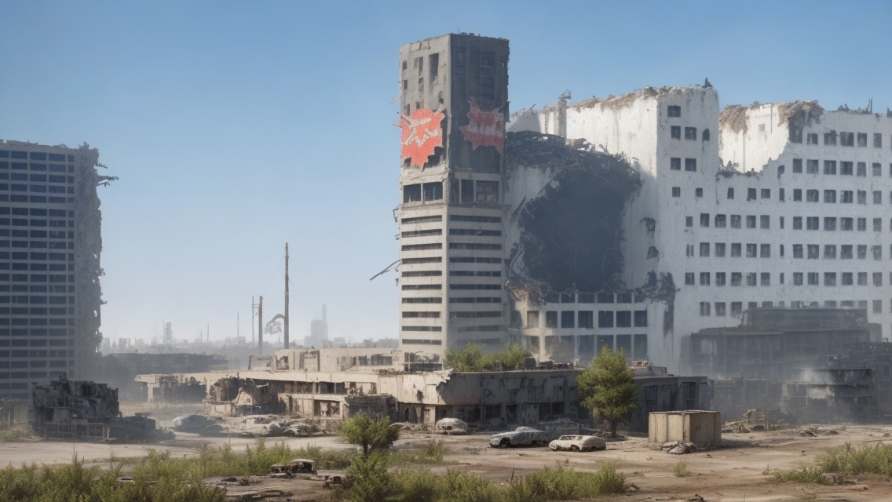

<geotag 
  latitude=29.70775320462402
  longitude=-95.40242768427136
  icon="HOSPITAL"
  name="Medical Center"
/>

- The Texas Medical Center, although not directly hit by nuclear strikes, faced turmoil in the aftermath of the Great
  War. Many patients, staff, and researchers perished during the chaos that followed, leaving the medical facilities in
  disarray.
- The area is now infested with mutated creatures drawn to the residual medical supplies and equipment. Survivors who
  venture into the Medical Center do so in search of advanced medical knowledge and supplies, but they must navigate the
  dangers lurking within the abandoned hospitals and laboratories.
- The Lone Star Republic occasionally conducts reconnaissance missions in the Medical Center to gather medical resources
  and intelligence.

## Spaceport District (Johnson Space Center)

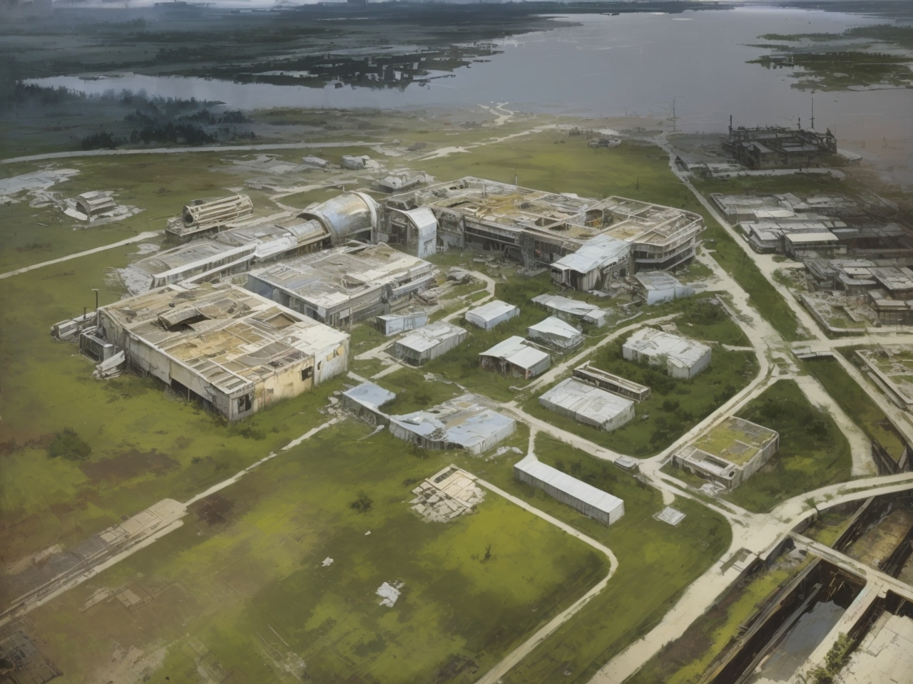

<geotag 
  latitude=29.560091666521437
  longitude=-95.09296989056149
  icon="ROCKET"
  name="Spaceport District"
/>

- The Johnson Space Center's Spaceport District endured a direct nuclear strike during the Great War. The surface
  facilities were severely damaged, but the underground vault, Vault 117, remained intact.
- The Spaceport Survivors have painstakingly restored and fortified the underground facilities, using pre-war technology
  to support their space program. The underground complex now serves as the heart of their operations, as they prepare
  for a historic manned rocket launch.
- The Lone Star Republic maintains a presence in the Spaceport District, offering protection and resources to support
  the space program's objectives and secure a potential gateway to the stars.
- Vault 117, hidden beneath the Spaceport District, serves as the primary base of operations for the Spaceport
  Survivors. Its massive underground halls house advanced technology, including a rocket assembly facility and a mission
  control center.
- The Spaceport Survivors have managed to keep their existence a closely guarded secret from most other factions,
  fearing that their advanced technology and knowledge could be exploited if discovered.
- A sense of awe and wonder permeates the Spaceport District as the Spaceport Survivors prepare for the historic manned
  rocket launch. This district represents the hope and ambition of returning to the stars after centuries of
  devastation.

### Satellite Arrays/Ground Stations

There are many satellite arrays and ground stations scattered across the wasteland. These are used to communicate with satellites in orbit.

| Name                                                                                                                                       | 
|--------------------------------------------------------------------------------------------------------------------------------------------|
| <geotag zoom=WASTELAND latitude=29.573215055042432 longitude=-95.0940195037338 name="Spaceport District Satellite Array" icon=SATELLITE /> |
| <geotag zoom=WASTELAND latitude=29.648424964030287 longitude=-96.05961230779872 name="Satellite Array" icon=SATELLITE />                   |
| <geotag zoom=WASTELAND latitude=30.496249623127518 longitude=-95.86313360228489 name="Satellite Array" icon=SATELLITE />                   |
| <geotag zoom=WASTELAND latitude=29.995294632284764 longitude=-95.14918382643299 name="Satellite Array" icon=SATELLITE />                   |
| <geotag zoom=WASTELAND latitude=29.980112335696607 longitude=-95.31695980904652 name="Satellite Array" icon=SATELLITE />                   |
| <geotag zoom=WASTELAND latitude=29.64333945315287 longitude=-95.273763752717 name="Satellite Array" icon=SATELLITE />                     |
| <geotag zoom=WASTELAND latitude=30.064099775231846 longitude=-95.54813540616497 name="Satellite Array" icon=SATELLITE />                   |
| <geotag zoom=WASTELAND latitude=29.861283994310817 longitude=-95.58390077157176 name="Satellite Array" icon=SATELLITE />                   |
| <geotag zoom=WASTELAND latitude=29.717904696820487 longitude=-95.41732433635413 name="Satellite Array" icon=SATELLITE />                   |
| <geotag zoom=WASTELAND latitude=30.070649956592845 longitude=-95.60574686143637 name="Satellite Array" icon=SATELLITE />                   |
| <geotag zoom=WASTELAND latitude=29.79732191911725 longitude=-94.40694268011607 name="Satellite Array" icon=SATELLITE />                    |
| <geotag zoom=WASTELAND latitude=30.070649956592845 longitude=-94.86434518665628 name="Satellite Array" icon=SATELLITE />                   |
| <geotag zoom=WASTELAND latitude=30.2052619187626 longitude=-95.70678502706018 name="Satellite Array" icon=SATELLITE />                     |
| <geotag zoom=WASTELAND latitude=30.329083976288928 longitude=-95.45145885176757 name="Satellite Array" icon=SATELLITE />                   |
| <geotag zoom=WASTELAND latitude=30.69021783456614 longitude=-95.55113163656236 name="Satellite Array" icon=SATELLITE />                    |
| <geotag zoom=WASTELAND latitude=30.050560520675745 longitude=-94.18438562261834 name="Satellite Array" icon=SATELLITE />                   |
| <geotag zoom=WASTELAND latitude=29.310353157587734 longitude=-95.55113162735292 name="Satellite Array" icon=SATELLITE />                   |
| <geotag zoom=WASTELAND latitude=29.361535499947568 longitude=-95.76413100353282 name="Satellite Array" icon=SATELLITE />                   |
| <geotag zoom=WASTELAND latitude=28.98122370816341 longitude=-95.38728595343919 name="Satellite Array" icon=SATELLITE />                    |

## The Energy Corridor

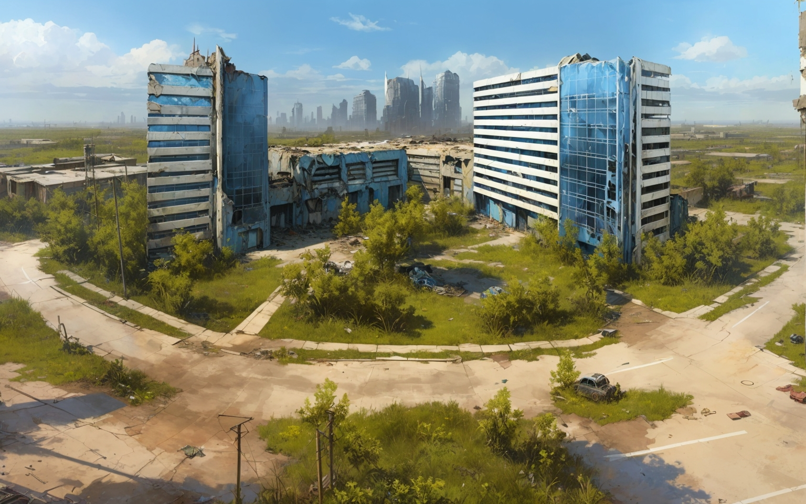

<geotag 
  latitude=29.78475344563217
  longitude=-95.63607055649126
  icon="DRILL"
  name="Energy Corridor"
/>

- The Energy Corridor, once a vital center for the energy industry, was targeted during the Great War due to its
  strategic importance. Many of the oil refineries and energy infrastructure in the area were destroyed.
- The Oil and Energy Barons have established control over what remains of the energy corridor. They oversee the remnants
  of oil rigs and refineries still functional, using them to maintain their dominance in the energy sector.
- The Barons fiercely protect these valuable resources, knowing that control over them ensures their continued influence
  and power in the Gulf Coast Wasteland.
- The Energy Corridor is a maze of rusted oil derricks, abandoned pipelines, and precarious catwalks. It is a dangerous
  place, where radiation leaks and pockets of flammable gas pose constant threats to those who dare to venture into the
  area.
- The Oil and Energy Barons oversee the extraction of oil from the remaining wells and the processing of fuel in
  makeshift refineries. They employ well-armed guards and maintain a monopoly over the energy resources of the region.
- The Barons have set up a clandestine research facility within the Energy Corridor, where they explore new ways to
  harness energy and investigate the connection between their pre-war predecessors and the Enclave.

- <geotag 
  latitude=29.78475344563217
  longitude=-95.63607055649126
  icon="DRILL"
  name="Helios Tower"
/> is the headquarters of Phoenix Energy, Leonard Petrovich's Energy Company, as well as the _de facto_ headquarters of the Oil Barons organization, given that Leonard Petrovich's personal office sits in the building.

## Uptown Houston

<geotag 
  latitude=29.7458025
  longitude=-95.46424437845525
  icon="CITY"
  name="Uptown Houston"
/>

- Uptown Houston, known for its commercial and residential affluence in the pre-war era, has suffered significant decay.
  Luxury apartments and high-end shops now stand in varying states of disrepair, their opulence faded.
- The Lone Star Republic maintains a presence in Uptown Houston, using it as a base for intelligence gathering and
  reconnaissance. The area serves as a key observation point for monitoring the activities of rival factions and
  safeguarding critical resources.
- Despite the deterioration, Uptown Houston remains a strategically important district in the ongoing struggle for
  dominance and survival in the Gulf Coast Wasteland.
- Uptown Houston's once-glamorous streets are now patrolled by Lone Star Republic scouts, who keep a close eye on the
  area's strategic vantage points and maintain a network of surveillance equipment.
- Survivors who call Uptown home have formed a resourceful community, using their knowledge of pre-war luxury goods to
  trade and barter with travelers passing through the district.
- The lavish pre-war apartments in Uptown have become sought-after shelters for those who can secure them. These
  apartments offer a stark contrast to the surrounding decay, with remnants of opulent lifestyles still visible.

## Port of Houston

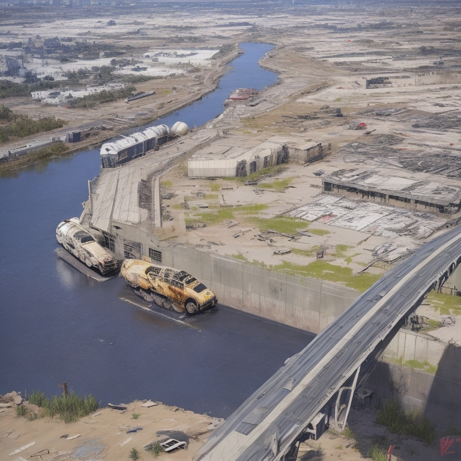

<geotag 
  latitude=29.609583371060147
  longitude=-95.01935161643323
  icon="MARINA"
  name="Port of Houston"
/>

- The Port of Houston, a critical gateway for trade and commerce, faced extensive damage during the Great War due to its
  economic significance. Many port facilities were heavily impacted by the destruction.
- The Galveston Pirates have claimed control over key sections of the Port, allowing them to levy tolls on incoming and
  outgoing shipments. They have fortified portions of the port to fend off rival factions, ensuring their dominance over
  this vital trade route.
- The Port of Houston is a hotspot for clashes and negotiations among factions, as control over this strategic maritime
  gateway is essential for accessing resources and maintaining trade.
- The Port of Houston's strategic importance is underscored by the constant tug-of-war between the Galveston Pirates and
  rival factions. The pirates have set up fortified watchtowers and control points to exact tolls and protect their
  domain.
- Many of the ships in the Port have been stripped down to their hulls, repurposed as makeshift homes and trading posts
  for survivors who seek refuge within the labyrinthine docks.
- The Port of Houston serves as the primary gateway for maritime trade in the region, making it a valuable prize for
  those who can secure control over it. It has become a center for smuggling, bartering, and backroom deals among
  factions.

## The Bayous and Wetlands

<geotag 
  latitude=29.762666342793505
  longitude=-95.3954616894298
  icon="SWAMP"
  name="The Bayou"
/>

- The bayous and wetlands surrounding Houston have become both a refuge and a danger. The Bayou Brotherhood, an
  isolationist faction, has made these waterlogged areas their home, preserving their unique culture and traditions.
- The wetlands are teeming with mutated wildlife, some of which have adapted to the radiation and harsh conditions.
  These areas serve as a source of sustenance and spiritual connection for the Bayou Brotherhood, who consider them
  sacred.
- The Bayous and Wetlands offer survivors a haven from the dangers of the wasteland, but navigating their treacherous
  waters requires skill and caution.
- The bayous and wetlands that meander through the Gulf Coast Wasteland are a stark contrast to the urban decay of
  Houston's neighborhoods. These areas are teeming with mutated wildlife, including enormous alligators, irradiated
  fish, and rare, valuable herbs.
- The Bayou Brotherhood has established hidden settlements throughout these wetlands, accessible only to those who have
  earned their trust. They utilize their deep knowledge of the bayous to navigate the treacherous waters.
- Despite the dangers posed by the wildlife and isolation, some survivors prefer the tranquility and abundance of
  resources offered by the bayous, making them a refuge for those seeking to escape the chaos of the wasteland.

## Museum District

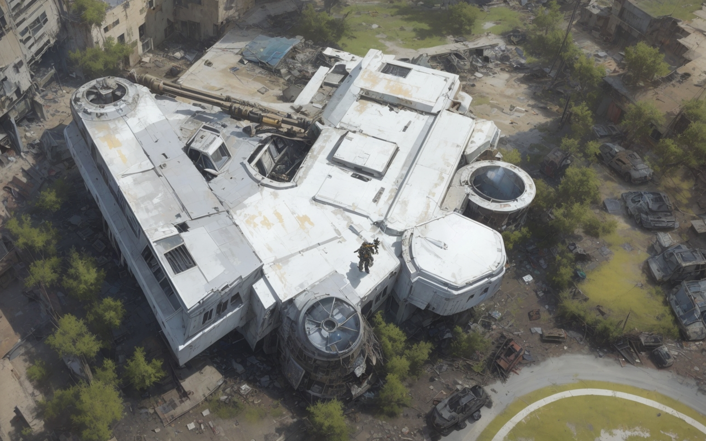

<geotag 
  latitude=29.72187722141612
  longitude=-95.39052797351329
  icon="CITY"
  name="Museum District"
/>

- Before the Great War, the Museum District was a cultural haven, home to a collection of world-class museums, art
  galleries, and educational institutions. It was a place where history, science, and art were celebrated and preserved.
- The district's iconic museums, including the Houston Museum of Natural Science and the Museum of Fine Arts, were
  renowned for their collections and exhibitions. While many of the priceless artifacts were relocated or lost, some
  remnants still remain in the abandoned museum buildings.
- In the post-apocalyptic era, the Museum District has taken on a new role. Some of the museums have become shelters for
  survivors, their grand halls now housing makeshift communities. Others have been fortified and repurposed as faction
  strongholds, as their secure architecture makes them ideal defensive positions.
- The Museum District serves as a microcosm of the Gulf Coast Wasteland's transformation, where the relics of the past
  stand as a testament to human history and creativity, juxtaposed against the struggles and adaptations of survivors in
  the present day.

## Western Reach (formerly Katy)

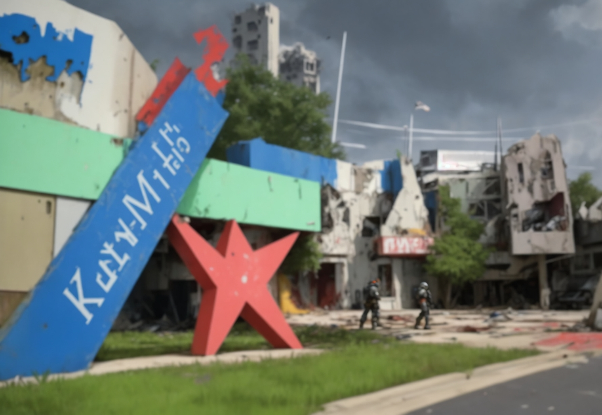

<geotag 
  latitude=29.779522718157338
  longitude=-95.812958453289
  icon="LARGE_SETTLEMENT"
  name="Western Reach"
/>

- Western Reach, situated to the west of the city, was once known as Katy in the pre-war era. It has since evolved into
  a resilient suburban community surrounded by the sprawling Energy Corridor.
- The settlers of Western Reach have developed a complex relationship with the Oil and Energy Barons who control the
  neighboring Energy Corridor. While the Barons maintain a tight grip on the area's oil resources, Western Reach has
  become an agricultural powerhouse, specializing in crops and livestock.
- Through trade agreements and occasional negotiations, Western Reach supplies the Barons with vital foodstuffs in
  exchange for a degree of protection and access to energy resources. This delicate balance ensures the survival of both
  factions in this strategic region.

## The Verdant Haven (formerly The Woodlands)

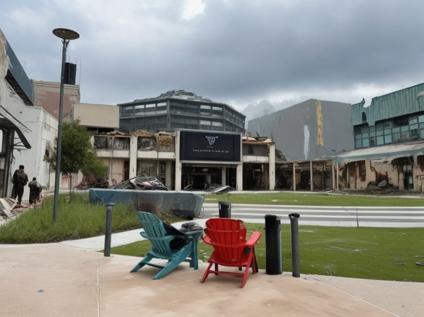

<geotag 
  latitude=30.163108904541257
  longitude=-95.45169046114991
  icon="WAREHOUSE"
  name="The Verdant Haven"
/>

- The Verdant Haven, formerly known as The Woodlands, is a haven of natural beauty and growth amidst the wasteland. The
  massive shopping mall that once defined the district has been partially reclaimed by nature and is now a treetop
  settlement known as Canopy Citadel.
- The mall itself has been repurposed into a bustling marketplace, where traders from all over the Gulf Coast Wasteland
  converge to exchange goods and stories. It has become a neutral ground where factions set aside their differences, at
  least temporarily, to engage in commerce.
- Canopy Citadel, located above the mall, has developed into a unique community where treehouses and platforms are
  interconnected with rope bridges. The residents of The Verdant Haven have found a balance between preserving the
  environment and utilizing its resources to support their way of life.
- Member settlement of the Lone Star Republic

## Sugar Junction (formerly Sugar Land)

<geotag 
  latitude=29.596879336664248
  longitude=-95.619345941272
  icon="FARM"
  name="Sugar Junction"
/>

- Sugar Junction, once known as Sugar Land, serves as a vital trade nexus in the Gulf Coast Wasteland. The New Liberty
  Trading Company (NLTC) established trading posts here, connecting the region with NLTC's capital elsewhere.
- NLTC's presence in Sugar Junction has transformed the settlement into a bustling marketplace, attracting traders from
  various factions who come to exchange goods, information, and technology. The NLTC ensures the flow of resources by
  maintaining secure trade routes and a network of communication.
- The settlers of Sugar Junction have adapted to the changing dynamics of the wasteland by becoming skilled negotiators
  and brokers. They leverage their position to forge alliances and maintain peaceful relations with many factions,
  making Sugar Junction a hub of diplomacy and economic activity.
- Member settlement of the Lone Star Republic

## Radiant Shores (formerly Pearland)

<geotag 
  latitude=29.568509857469653
  longitude=-95.28472826689617
  icon="RADIATION"
  name="Radiant Shores"
/>

- Radiant Shores, formerly known as Pearland, is an independent settlement known for its strong sense of community and
  resourcefulness. While not officially part of the Lone Star Republic, the settlers here share common values with the
  Republic's ideals.
- Most of the residents of Radiant Shores are Ghouls.
- The residents of Radiant Shores have repurposed pre-war schools and community centers into education hubs, where
  survivors teach essential skills, history, and survival tactics to the younger generation.
- The settlement's leaders have established diplomatic ties with the Lone Star Republic, aligning their interests in
  maintaining order and protecting their community from external threats. Radiant Shores serves as a beacon of
  cooperation between independent settlements and the Republic.

## Cypress Fields (formerly Cypress)

<geotag 
  latitude=29.970438298463094
  longitude=-95.69711770464674
  icon="FARM"
  name="Cypress Fields"
/>

- Cypress Fields, once known simply as Cypress, stands as a prominent and influential settlement within the Lone Star
  Republic. This thriving agricultural community has embraced its vast open lands, turning them into the primary source
  of food production for the Republic and its surrounding territories.
- The settlers of Cypress Fields have a strong sense of loyalty to the Lone Star Republic, and their settlement holds a
  prominent position in the Republic's political landscape. Cypress Fields is represented by respected senators in the
  Lone Star Senate, who advocate for the settlement's interests and needs.
- With its vast farmlands and ranches, Cypress Fields contributes significantly to the Republic's self-sufficiency and
  stability, making it a linchpin in the region's efforts to rebuild and prosper.

## Bountiful

<geotag
  latitude=30.000121379969222
  longitude=-95.53270618931042
  icon="CHURCH"
  name="Bountiful"
/>

Bountiful is a settlement full of (mostly) members of the Church of Jesus Christ of Latter-day Saints. The settlement is clustered around their pre-war temple, which they continue to use as a place of worship. The settlement is a farming community, and they are known for their generosity and hospitality. They are also known for their strong sense of community and their willingness to help others. Across the square from the temple is the <geotag latitude=30.00284108805913 longitude=-95.53162974704712 icon=WAREHOUSE zoom=TOWN name="Bountiful Harvest"/>, a reformed pre-war grocery store turned into the largest food storage warehouse in the Gulf Coast Wasteland. The warehouse is run by members of the Church and is stocked primarily from the farms of Bountiful. The warehouse is open to all, and the Church encourages people to take what they need, but will often request that those who partake give some sort of service. The Church also encourages people to donate what they can to the warehouse, so that they can continue to help others. 

The settlement of Bountiful has a tenuous relationship with the Lone Star Republic, especially as the LSR continues to expand. The LSR attempted to diplomatically annex Bountiful, to gain access to their great food reserves and farms, but the settlers refused, given their strong sense of independence and colored history with governments coercing members of their faith. The LSR has since backed off, but several members of the LSR Senate have expressed interest in annexing Bountiful by force. The LSR has also attempted to establish a trade agreement with Bountiful, which the leaders of Bountiful have been open to, but the LSR has not been able to offer anything that Bountiful needs.

Bountiful is lead by a Stake Presidency (a president and two counselors) and a High Council (a council of 12 elders), who members of the settlement view as leading by revelation from God. The Stake President is chosen by revelation the Church's First Presidency and Quorum of Twelve Apostles (who live in the Church's headquarters in Utah, but frequently travel to visit all the stakes of the Church in every land). The Stake President chooses his counselors, and the stake presidency together call the High Council. The settlement is further divided into wards (which are both congregations and communal subdivisions), each led by a Bishop and other leaders.

The settlement is protected by a paramilitary organization called the Eagles, which is a volunteer militia formed of the men of the settlement.

### Notable NPCs

- Stake President Ezra Bennett: The spiritual leader of Bountiful, Stake President Ezra Bennett, is a wise and revered figure. Known for his humility and dedication to the settlers, he seeks divine guidance to navigate the challenges facing the community.
- Bishop Richmond Taylor: Bishop Richmond Taylor oversees one of Bountiful's wards and is a compassionate leader. He is involved in community outreach and often tasks the player with missions that involve helping settlers in need. He is also the father of [Kristi Taylor](oilbarons.md#kristi-taylor)
- Elder Matthias Harris: Elder Matthias Harris, a member of the High Council, is a shrewd and strategic thinker. He plays a key role in handling external threats and is willing to take bold actions to protect Bountiful.
- Sister Miriam Young: Sister Miriam Young is an expert herbalist and healer, responsible for the settlement's medical well-being. She provides the player with quests related to finding rare herbs and treating ailments within the community.
- Lone Star Republic Envoy, Ambassador Lorraine Clark: Ambassador Lorraine Clark represents the Lone Star Republic and is determined to establish a working relationship with Bountiful. Her motives may be more complex than they appear, and the player must navigate the political landscape to understand her true intentions.
- Elderly Farmer, Sister Margaret Carter: Sister Margaret Carter is a respected elder in Bountiful known for her years of dedication to farming. Despite her age, she continues to work the fields and offers the player insights into traditional farming methods. She might task the player with preserving and passing on these agricultural practices.
- Merchant and Trader, Brother Isaac Wallace: Brother Isaac Wallace operates a small trading post within Bountiful, dealing in surplus crops, handmade goods, and essential supplies. His shrewd business sense makes him a crucial figure in facilitating trade within the settlement. The player can engage in quests related to expanding trade connections or resolving trade disputes.
- Youthful Engineer, Brother Caleb Parker: Brother Caleb Parker is a young and ambitious member of Bountiful with a talent for tinkering with pre-war technology. He dreams of revitalizing ancient machinery to improve the settlement's efficiency. The player may assist Brother Caleb in locating and repairing pre-war devices, uncovering forgotten technological marvels.
- Devoted Teacher, Sister Emily Lewis: Sister Emily Lewis serves as an educator within Bountiful, ensuring the transmission of knowledge to the settlement's youth. She may request the player's help in acquiring educational materials from the wasteland, emphasizing the importance of preserving pre-war literature and scientific knowledge.
- Wasteland Explorer, Brother Daniel Hughes: Brother Daniel Hughes is a daring adventurer who frequently explores the surrounding wasteland in search of valuable resources and information. His quests might involve recovering lost artifacts or uncovering pre-war secrets that could benefit Bountiful. Despite the risks, Brother Daniel's discoveries contribute to the settlement's resilience.

### Quests

#### The Harvest Festival Dilemma

_Quest Giver: Bishop Elijah Stone_

Bountiful is preparing for its annual Harvest Festival, a celebration of abundance and community. However, tensions arise when rumors spread that the Lone Star Republic might see the festival as an opportune time to assert control. The player is tasked with navigating the delicate situation, ensuring the festival proceeds smoothly while keeping an eye out for any potential threats or covert actions from Lone Star Republic spies.

#### The Lost Livestock Predicament

_Quest Giver: Sister Abigail Foster_

Bountiful's livestock has been mysteriously disappearing, and the settlers suspect foul play. Sister Abigail, in charge of the settlement's animal husbandry, asks the player to investigate. As the player delves into the mystery, they discover a group of mutated creatures threatening the livestock. The challenge is not only to eliminate the threat but also to find a long-term solution to protect Bountiful's vital source of sustenance.

#### The Lone Star Diplomat's Dilemma

_Quest Giver: Elder Samuel Harris_

A Lone Star Republic diplomat arrives in Bountiful, seeking to rekindle negotiations for a trade agreement. The player is asked to act as a mediator between the diplomatic envoy and the wary leaders of Bountiful. The challenge is to navigate the negotiations diplomatically while uncovering any hidden agendas that may affect the settlement's autonomy.

#### The Hidden Threat

_Quest Giver: High Councilor Esther Thompson_

High Councilor Thompson receives troubling information about a potential internal threat to Bountiful's security. The player is tasked with discreetly investigating the matter, unraveling a plot that involves a group of dissenters within the settlement. Choices made during the quest can impact the community's unity and stability.

#### The Exodus to Zion

_Quest Giver: Brother Jacob Reynolds_

Brother Jacob, a devout member of the Church who holds heterodox views, sometimes finds himself in conflict with Leadership. He believes that the Church should leave the Gulf Coast Wasteland and travel to Zion, a city and land in pre-war Missouri that early church leaders prophesied would be a place where Jesus Christ would return and reign personally upon the earth. He asks the player to help him convince others to start a convoy and travel to Zion. President Ezra Bennet and his Bishop Elijah Stone, although they affirm that one day all the Saints will gather in Zion, the Saints have not yet been commanded to gather there, and thus should remain in the Gulf Coast Wasteland. Depending on the player's choices, Brother Jacob may be convinced to stay in Bountiful, or he may leave with a group of dissenters to start a new settlement in Zion. The outcome will also  

## Solaris Sanctuary

<geotag
  latitude=30.255585402743918
  longitude=-95.83624947105992
  icon="SETTLEMENT"
  name="Solaris Sanctuary"
/>

In the irradiated remnants of Houston, where the echoes of a bygone era mix with the harsh realities of a post-apocalyptic world, the settlement of Solaris Sanctuary has emerged as a beacon of hope and resilience. Nestled in the ruins, this unique enclave draws inspiration from the Houston Renaissance Festival of ancient times, creating a fusion of Renaissance charm and survivalist pragmatism. The people of Solaris Sanctuary, known as "Solarites," are a tight-knit community of artisans, performers, and scavengers. Clad in makeshift Renaissance-style attire, they have embraced the spirit of creativity and adaptation, using their skills to transform the desolation around them into a thriving haven.

### Locations within Solaris Sanctuary

- The Solar Square: At the heart of the settlement lies the Solar Square, echoing the festive atmosphere of the Renaissance fair. Here, Solarites gather for celebrations, trade, and communal activities. A makeshift stage hosts performances ranging from post-apocalyptic minstrels to acrobatic feats.
- The Tudor Tavern: A central hub for socializing, the Tudor Tavern is a repurposed structure adorned with salvaged tapestries and wooden furnishings. Solarites come here to share stories, trade goods, and enjoy drinks brewed from locally sourced ingredients.
- The Jousting Grounds: Reminiscent of the Renaissance jousting tournaments, the Jousting Grounds serve as both an arena for combat training and a venue for thrilling competitions. Solarites showcase their combat prowess in friendly duels, reinforcing the settlement's commitment to self-defense.
- The Artisan's Alley: Lining the settlement's pathways, the Artisan's Alley is a collection of makeshift stalls and workshops where skilled craftsmen and women create and trade their wares. From repurposed technology to handcrafted leather goods, Solarites display their ingenuity in this bustling marketplace.
- The Garden of Renewal: A tranquil oasis within the settlement, the Garden of Renewal features a vibrant assortment of flora cultivated from pre-war seeds. Solarites come here to find solace and reflect, surrounded by the beauty of nature thriving amid the ruins.
- The Fortune Teller's Tent: A mysterious tent adorned with scavenged fabrics and mystical trinkets, the Fortune Teller's Tent is a gathering place for those seeking guidance in this uncertain world. A wise Solarite known as Madame Celestia offers cryptic insights and advice to those who dare to peer into their fate.
- The Blacksmith's Forge: Housed in a repurposed industrial building, the Blacksmith's Forge is where skilled artisans craft essential tools and weapons using salvaged materials. The clang of hammers on anvils resonates through the air as Solarites work diligently to ensure the settlement's survival.

### Notable Residents

- Lord Cedric Ironheart: A charismatic and well-spoken leader, Lord Cedric Ironheart is the de facto ruler of Solaris Sanctuary. With a background in diplomacy and a vision for a united community, Lord Cedric strives to maintain order and ensure the well-being of all Solarites.
- Lady Isabella Emberweave: A skilled herbalist and healer, Lady Isabella Emberweave tends to the sick and wounded in Solaris Sanctuary. Her knowledge of medicinal herbs and ancient remedies has made her an invaluable asset to the community, earning her the respect and admiration of her fellow Solarites.
- Captain Reyna Stormblade: As the head of the settlement's militia, Captain Reyna Stormblade is a formidable warrior with a no-nonsense attitude. With a background in military tactics, she oversees the defense of Solaris Sanctuary and trains residents in combat techniques.
- Maestro Lorenzo Bardolino: A talented musician and composer, Maestro Lorenzo Bardolino entertains the community with his haunting melodies played on a salvaged instrument. He also serves as the organizer of various musical events and celebrations within the settlement.
- Aria Swiftwind: A nimble and agile acrobat, Aria Swiftwind enchants the Solar Square with her breathtaking aerial performances. Her skills not only entertain but also inspire others to push their physical limits in the name of self-expression.
- Blacksmith Thorne Ironforge: A grizzled and experienced blacksmith, Thorne Ironforge operates the Blacksmith's Forge, crafting essential tools and weapons for the settlement. His skill with metal and dedication to his craft make him a respected figure in Solaris Sanctuary.
- Madame Celestia the Seer: A mysterious fortune teller with an air of enigma, Madame Celestia operates the Fortune Teller's Tent. Residents seek her counsel for guidance in the uncertain world, and her cryptic insights have earned her a reputation as a wise oracle.
- Elena Silverleaf: A skilled archer and scavenger, Elena Silverleaf is known for her prowess with a bow and her ability to navigate the treacherous outskirts of the settlement. She often leads expeditions to gather essential resources and defend against external threats.
- Gideon Stonehaven: A jovial and friendly trader, Gideon Stonehaven manages a stall in the Artisan's Alley. His expertise lies in scavenging rare and valuable artifacts from the wasteland, making him a go-to source for unique items within the settlement.
- Matilda Greenleaf: The caretaker of the Garden of Renewal, Matilda Greenleaf has a deep connection with nature and a talent for cultivating pre-war seeds. Her serene demeanor and green thumb make the garden a peaceful retreat for those seeking solace in the midst of chaos.

### Quests
#### Side Quest: The Lost Relic of Solaris

_Quest Giver: Blacksmith Thorne Ironforge_

Solaris Sanctuary's blacksmith, Thorne Ironforge, uncovers an ancient blueprint hinting at the existence of a powerful pre-war weapon known as the "Solaris Blade." The blueprint suggests that the components are scattered throughout the wasteland. The player must embark on a quest to locate these rare materials, facing challenges and uncovering the weapon's history. Once assembled, the Solaris Blade could become a symbol of hope and strength for the settlement.

#### Side Quest: The Phantom Minstrel

_Quest Giver: Maestro Lorenzo Bardolino_

Maestro Lorenzo is disturbed by reports of a mysterious phantom minstrel haunting the outskirts of Solaris Sanctuary. The spectral musician's melancholic tunes are said to influence the emotions of those who hear them. The player must track down the phantom, unravel its backstory, and decide whether to help it find peace or confront the potential threat it poses to the settlement's emotional balance.

#### Side Quest: Ephemeral Elixirs

_Quest Giver: Lady Isabella Emberweave_

Lady Isabella discovers an old alchemical recipe for a potion rumored to grant temporary glimpses into the past. In hopes of uncovering lost knowledge or locating valuable resources, she tasks the player with gathering rare ingredients scattered across the wasteland. As the player brews and consumes the elixir, they experience vivid visions that may hold clues to forgotten technologies or hidden dangers.

#### Side Quest: The Great Solar Race

_Quest Giver: Captain Reyna Stormblade_

To boost morale and showcase Solaris Sanctuary's strength, Captain Reyna organizes a grand scavenger hunt and obstacle course known as "The Great Solar Race." The player is invited to participate, competing against other residents and overcoming challenges inspired by the Renaissance fair's activities. Success not only earns recognition but also contributes to the settlement's overall preparedness.

#### Side Quest: The Enigmatic Engineer

_Quest Giver: Lord Cedric Ironheart_

Lord Cedric receives a distress signal from an unknown engineer claiming to possess advanced technological knowledge. The player is tasked with locating this mysterious individual and bringing them to Solaris Sanctuary. Upon finding the engineer, it becomes evident that they hold the key to unlocking dormant technologies that could greatly benefit the settlement. However, the engineer is wary of sharing their knowledge and may have alternative motives.

#### Other Quest Ideas

As Solaris Sanctuary is on the outskirts of the Gulf Coast Wasteland, most players will not likely encounter it organically. As such, it may be worth considering a quest that will lead players to Solaris Sanctuary. A few ideas for such a quest are:

##### Side Quest: Distress Signal from Solaris

_Quest Trigger: Players intercept a distress signal or find a message mentioning a safe haven with a unique community._

The players come across a distress signal originating from Solaris Sanctuary, indicating that the settlement is facing a threat or crisis. The signal may be picked up from a distant radio frequency, a bulletin board, or a survivor's journal. Intrigued by the call for help, the players decide to investigate and offer assistance, leading them to the distant and unique settlement.

##### Side Quest: Trade Routes and Rumors

_Quest Trigger: Players encounter traders or scavengers mentioning a prosperous settlement with valuable resources._

Traveling merchants or scavengers in the wasteland share rumors about a thriving settlement known as Solaris Sanctuary. They speak of unique goods, skilled artisans, and the potential for valuable trade. Intrigued by the prospect of new opportunities, the players decide to seek out this hidden enclave and explore the potential benefits of establishing trade connections.

##### Side Quest: The Wandering Bard's Tale

_Quest Trigger: Players encounter a wandering bard or storyteller mentioning a sanctuary with a rich cultural heritage._

A wandering bard crosses paths with the players, sharing tales of a settlement that blends Renaissance charm with survivalist ingenuity. The bard's stories speak of unique traditions, valuable relics, and a community that has managed to thrive against all odds. Intrigued by the tales, the players decide to seek out this intriguing settlement and experience its cultural richness firsthand.

##### Side Quest: Artifacts of the Ancients

_Quest Trigger: Players discover or are informed about the potential existence of valuable pre-war artifacts near Solaris Sanctuary._

The players come across information or rumors about the presence of rare and valuable pre-war artifacts in the vicinity of Solaris Sanctuary. These artifacts could include advanced technology, historical documents, or even relics of cultural significance. Eager to uncover these treasures, the players decide to venture towards the settlement and explore the surrounding areas for these valuable finds.

##### Side Quest: The Mysterious Invitation

_Quest Trigger: Players receive a cryptic message or invitation from an unknown source leading them to Solaris Sanctuary._

The players find or receive a mysterious invitation, beckoning them to visit Solaris Sanctuary for a purpose unknown. The message hints at unique opportunities, rewards, or challenges awaiting those who choose to accept. Intrigued by the enigmatic nature of the invitation, the players decide to follow the clues and uncover the secrets of Solaris Sanctuary.

## Galveston 

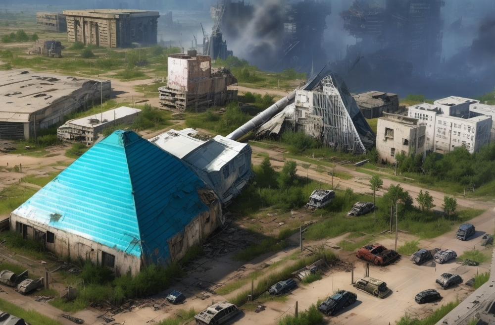

<geotag 
  latitude=29.271817270864048
  longitude=-94.85169693780138
  icon=PIRATE
  name="Galveston"
/>

- Galveston is a major settlement on Galveston Island, known for its bustling maritime activity and the
  stronghold of the Galveston Pirates. The docks serve as the pirates' primary base of operations, from where they
  control access to the Port of Houston.
- Some parts of Galveston have been transformed into ramshackle communities where indentured servants and
  those forced into the pirates' service live in squalor, constantly seeking opportunities for escape.
- Despite the dangers posed by the pirates, some independent traders and factions maintain a presence in the area, drawn
  by the potential for lucrative maritime trade and access to the Gulf of Mexico.

### Landmarks

- <geotag latitude=29.30406673538081 longitude=-94.79083962164606 icon=CHURCH name="St. Mary's Cathedral Basilica" zoom=TOWN /> is a Pre-war catholic church that repurposed as a place for worship by many of the settlers in Galveston. The church is known for its beautiful stained glass windows and its bell tower, which still rings every Sunday.
- <geotag latitude=29.303592296370436 longitude=-94.79556064626323 icon=HAUNTED_HOUSE name="The Haunted Hotel" zoom=TOWN /> is a pre-war hotel that has been abandoned since the Great War. The hotel is rumored to be haunted by the spirits of those who died during the war, and many settlers avoid the building at all costs. Despite the spooky sightings, many scavengers still venture into the hotel in search of pre-war artifacts.
- <geotag latitude=29.308933433767418 longitude=-94.79426192576881 icon=MARINA name="Galveston Docks" zoom=TOWN /> serves as the primary settlement on Galveston Island and is the stronghold of the Galveston Pirates. The docks bustle with maritime activity, with various ships coming and going under the control of the pirates. The docks themselves are fortified, with makeshift barriers and watchtowers manned by pirate guards. Within the docks, there are ramshackle communities where indentured servants and captured settlers live in poor conditions, forced to serve the pirates under threat of violence. The docks are also home to black market traders who operate discreetly under the pirates' watchful eye.
- <geotag latitude=29.28769522061656 longitude=-94.79049190118054 icon=AMUSEMENT_PARK name="Pleasure Pier" zoom=TOWN /> is a pre-war amusement park that has been converted into a center of trade and commerce. Many vend and peddle their wares along the boardwalk. Many other events and activities also occur here:
  - **Trade and Commerce**: The Pleasure Pier would still be a focal point for trade and commerce, with settlers and independent traders setting up makeshift stalls and marketplaces to sell goods and services. These traders would offer a variety of items, ranging from scavenged supplies and weapons to homemade crafts and foodstuffs.
  - **Black Market: Beneath** the surface of legitimate trade, the Pleasure Pier would also be a hotspot for illicit dealings and black market transactions. Pirates and smugglers would frequent the pier to fence stolen goods, acquire contraband items, and engage in underground trade with settlers and traders willing to turn a blind eye to the pirates' activities.
  - **Information Exchange**: The Pleasure Pier would serve as a gathering place for rumors, gossip, and intelligence gathering. Settlers, traders, and pirates alike would congregate at the pier to exchange information, share news about recent pirate raids or Lone Star Republic movements, and form alliances or rivalries based on mutual interests or conflicts.
  - **Recruitment Center**: The pirates would use the Pleasure Pier as a recruitment center, seeking to bolster their ranks with willing volunteers or captured prisoners forced into servitude. Pirate recruiters would roam the pier, offering promises of wealth, adventure, and protection to those willing to join their crew, while simultaneously intimidating or coercing reluctant recruits into compliance.
  - **Entertainment and Distraction**: Despite the harsh realities of the post-apocalyptic wasteland, the Pleasure Pier would still offer a semblance of entertainment and distraction for the inhabitants of Galveston Island. Performers, musicians, and entertainers would ply their trade along the pier, providing moments of respite and escapism amidst the chaos and uncertainty of daily life.
- <geotag latitude=29.266046640682312 longitude=-94.8285072739211 icon=DEFENSE name="Seawall Stronghold" zoom=TOWN /> is a fortified defensive position along the coast of Galveston Island, built to protect the settlement from external threats. The Seawall Stronghold is manned by the Galveston Pirates' elite guards and serves as a last line of defense against hostile forces attempting to breach the island's defenses. The stronghold features watchtowers, barricades, and artillery emplacements, providing a strategic advantage in repelling attacks from land or sea. The Seawall Stronghold also houses the pirates' armory, where weapons, ammunition, and supplies are stockpiled to ensure the settlement's security.
- <geotag latitude=29.274104955672872 longitude=-94.8513744838117 icon=FARM name="Garden Pyramid" zoom=TOWN /> is a pre-war botanical garden that has been repurposed into farmland feeding the settlement.
- <geotag latitude=29.285244477697365 longitude=-94.80729874919265 icon=LIGHT name="Abandoned Lighthouse" zoom=TOWN /> has been abandoned since the Great War. The lighthouse is rumored to be haunted by the ghosts of its former keepers and is avoided by superstitious locals. However, brave adventurers may find valuable treasures hidden within its decaying walls.
- <geotag latitude=29.31275678680049 longitude=-94.77584211277309 icon=HOSPITAL name="Hospital" zoom=TOWN />
- <geotag latitude=29.335404488063293 longitude=-94.75324347675392 icon=DEFENSE name="Lone Star Ferry Checkpoint" /> is a fortified checkpoint recently established by the Lone Star Republic and managed by the Texas Ranger Coast Guard. The checkpoint serves as a strategic location for monitoring maritime traffic, inspecting vessels for contraband, and enforcing the Republic's laws along the coast. The Texas Rangers stationed at the checkpoint are responsible for maintaining order, preventing piracy, and safeguarding the waters surrounding Galveston Island. The checkpoint also acts as a diplomatic outpost, facilitating communication between the Lone Star Republic and independent settlements in the region. Although the Rangers have not managed to expand their influence further onto the island, this checkpoint and [Fort Travis](#bolivar-settlement-bolivar-peninsula) allow the Lone Star Republic to protect many of its interests along the coast.
- <geotag latitude=29.302934537457975 longitude=-94.78229830867977 icon=SETTLEMENT name="Bishop's Bastion" /> is a fortified mansion atop a hill overlooking the Galveston, inspired by the pre-war Bishop's Palace. The mansion currently serves as the residence of Captain Redhawk, one of the leaders of the Galveston Pirates. It is heavily guarded and contains a treasure trove of stolen riches and valuable artifacts looted from raided settlements.
- <geotag latitude=29.292917090362376 longitude=-94.78604407408724 icon=DICE name="Lone Star Casino" /> is a pre-war resort converted into a casino frequented by pirates. The casino serves as a hub for gambling, entertainment, and illicit dealings, attracting settlers, traders, and pirates looking to test their luck or engage in high-stakes games of chance. The Lone Star Casino is known for its opulent decor, extravagant shows, and underground gambling dens where fortunes can be won or lost in an instant.

### Battleship Texas

The <geotag latitude=29.282711453852222 longitude=-94.839582835665 icon=BOAT name="Battleship Texas" /> is a formerly decommissioned Battleship used by the United States Navy during World Wars I and II. It was decommissioned and converted into a Museum Ship after WWII, floating in the Houston Ship Channel just outside the Buffalo Bayou (near the San Jacinto Monument). In 2280, with the assistance of the Cartels, the Galveston Pirates managed to get the ship operational again, and sailed it to its current location in the Galveston Docks. The ship was then renovated and is now the Galveston Pirates' primary (yet mobile) base of operations, and is used to launch raids on the Port of Houston and other settlements along the coast.

  - Ship Retrofitting:
    
    - Purpose: Originally a naval vessel, the Battleship Texas underwent extensive retrofitting to serve as the Galveston Pirates' mobile base.
    - Nuclear Engines: Fitted with Fallout-themed nuclear engines for propulsion, providing both power and mobility.
    - Weapon Systems: Enhanced with a mix of energy weapons, ballistic cannons, and salvaged pre-war naval weaponry for defense and offense.

  - Command and Control:
    
    - Bridge Overhaul: The original ship's bridge has been transformed into a high-tech command center where the Council of Captains makes strategic decisions.
    - Communications Array: Powerful long-range communications equipment salvaged from pre-war military installations, allowing the Pirates to stay informed and coordinate operations.

  - Living Quarters:
    
    - Captain's Quarters: Each captain has their own private quarters with a mix of salvaged pre-war luxury items and functional, post-apocalyptic necessities.
    - Crew Dormitories: Spacious communal living areas for the crew, maximizing efficiency in the limited space available.

  - Workshop and Repair Facilities:
    
    - Engineering Bay: A dedicated area for repairs and modifications, equipped with tools salvaged from pre-war military and industrial facilities.
    - Technical Expertise: Skilled engineers and mechanics among the crew ensure the Battleship Texas remains operational in the harsh post-apocalyptic environment.

  - Security Measures:
    
    - Automated Defenses: Integrated automated defense systems, including turrets and security robots, protect the Battleship Texas from external threats.
    - Guard Posts: Manned security posts strategically placed throughout the ship to deter potential internal threats.

  - Resource Storage:
    
    - Cargo Holds: Repurposed cargo holds store the plundered resources, weapons, and supplies acquired during raids and smuggling operations.
    - Trade Goods: A section dedicated to storing items for trade, including chems, technology, and other valuable commodities.

  - Cultural and Recreational Spaces:
    
    - Common Areas: Spaces for socializing and relaxation, fostering a sense of community among the crew.
    - Training Facilities: Areas for combat training, ensuring the crew remains proficient in both individual and group combat scenarios.

  - Navigation and Stealth Systems:
    
    - Stealth Modifications: Stealth technology salvaged from pre-war military vessels enables the Battleship Texas to approach targets discreetly.
    - Navigation Computer: A sophisticated navigation computer assists in plotting courses and avoiding hazards in the treacherous Gulf waters.

  - Flagship Aesthetics:
    
    - Pirate Insignia: Prominent displays of the Galveston Pirates' insignia and flags to establish a distinct identity as a formidable maritime force.
    - Intimidating Appearance: The Battleship Texas is adorned with fearsome imagery and symbols, reflecting the ruthless nature of the Galveston Pirates.

  - Maintenance and Sustainability:
    
    - Resource Gathering: Specialized equipment for gathering resources while at sea, such as water purification systems and improvised farming setups.
    - Sustainable Practices: Efforts to maintain the ship's functionality with limited resources, recycling and repurposing materials whenever possible.

### Notable NPCs
- **Marisol "Marauder" Cortez**: A fierce and cunning pirate captain known for her ruthless tactics and daring raids. Marauder commands her own crew of cutthroats and is feared by both settlers and rival pirates alike.
- **Doctor Ezekiel "Doc" Blackwood**: The resident medic of Galveston, Doc Blackwood operates a makeshift clinic in the settlement, providing medical care to pirates and settlers alike. Despite his gruff exterior, he genuinely cares for the well-being of those in need.
- **"Lucky" Louie Malone**: A charming and charismatic gambler who runs the Lone Star Casino. Louie is always looking for new patrons to fleece and is willing to offer information or assistance to those who catch his eye.
- **Samantha "Siren" O'Malley**: A talented musician and entertainer who performs at the Pleasure Pier. Siren's captivating voice and mesmerizing performances draw crowds from far and wide, making her a popular figure among the residents of Galveston.
- **Elijah "Scrapheap" Ramirez**: The chief engineer of the Battleship Texas, Scrapheap is a brilliant inventor and tinkerer who keeps the ship's systems running smoothly. He is always on the lookout for salvageable technology and is willing to trade or sell his inventions to those with the caps to pay.
- **Carter "Ratcatcher" Thompson**: A skilled tracker and scout who prowls the outskirts of Galveston, hunting down threats to the settlement. Ratcatcher is a loner by nature but is always willing to lend a hand to those in need, especially if it means eliminating a common enemy. He laments the fact that his home has been taken over by pirates and is always looking for a way to take it back.
- **Isabella "Buccaneer" Vasquez**: A former member of the Mexican Cartels who defected to the Galveston Pirates, Buccaneer now serves as Captain Mariposa's second-in-command. She is fiercely loyal to her captain and will stop at nothing to ensure the Cartel's interests are protected.
- **Reverend Jeremiah "Preacher" Monroe**: The spiritual leader of the settlers in Galveston, Preacher Monroe offers guidance and comfort to those who seek solace in the wasteland. He preaches a message of hope and redemption, urging his followers to resist the temptations of the pirates and find strength in their faith.
- **Madame Delphine LeBeau**: The enigmatic proprietor of the Haunted Hotel, Madame LeBeau is rumored to possess mystical powers and a connection to the supernatural. She welcomes guests to her establishment with a knowing smile and offers them a chance to confront their deepest fears.
- **Gideon "Grim" Blackwood**: Doc Blackwood's estranged brother and a notorious raider who leads a gang of cutthroats known as the Blackwood Marauders. Grim is a merciless killer who delights in causing chaos and mayhem wherever he goes.
- **Captain Evelyn "Tempest" Shaw**: A former member of the Lone Star Republic who defected to the Galveston Pirates, Tempest now commands her own crew of skilled sailors. She is known for her tactical prowess and fierce loyalty to Captain Redhawk.
- **Milo "Mute" Rodriguez**: A mute scavenger who roams the ruins of Galveston in search of valuable salvage. Despite his inability to speak, Mute communicates through gestures and expressions, and his keen eye for treasure makes him a valuable ally to those who earn his trust. He was captured by the pirates and forced to work for them, but he secretly longs for freedom.
- **Lucinda "Lucky Lou" Sanchez**: The savvy operator of a smuggling operation based out of Galveston. Lucky Lou specializes in trafficking chems and contraband across the Gulf of Mexico, using her wits and charm to evade the authorities and turn a tidy profit.
- **Captain Hector "Harpoon" Vega**: The grizzled captain of the Lone Star Republic Coast Guard patrol boat stationed at the Lone Star Ferry Checkpoint. Harpoon takes his duty seriously and is determined to keep the waters around Galveston safe from pirates and other threats.

### Side Quests

#### Side Quest: Pirate's Trial
*Quest Giver: A member of the Pirate Council*
A member of the Galveston Pirates has been accused of betraying the Pirate's Code and faces execution. The player characters must gather evidence, interrogate witnesses, and decide the accused pirate's fate in a trial by combat or diplomacy.
#### Side Quest: Pirate's Code
*Quest Giver: Carter "Ratcatcher" Thompson*
A group of settlers living under pirate rule seeks to overthrow their oppressors but lacks the strength to do so alone. The player characters must help them rally support, train fighters, and launch a rebellion against the Galveston Pirates.
#### Side Quest: "Raiders on the Run"
*Quest Giver: Carter "Ratcatcher" Thompson*
Description: Ratcatcher asks the player to track down a group of raiders who have been ambushing travelers along the road to Galveston. The player must investigate possible hideouts, gather information, and confront the raiders to put an end to their reign of terror.
#### Side Quest: "Medicine Run"
*Quest Giver: Doctor Ezekiel "Doc" Blackwood*
Description: Doc Blackwood needs the player to retrieve a shipment of medical supplies from a nearby abandoned hospital. The hospital is infested with mutants and scavengers, making the task dangerous but essential for the survival of the settlement.
#### Side Quest: "The Ghost Ship"
*Quest Giver: Madame Delphine LeBeau*
Description: Madame LeBeau tells the player about rumors of a ghost ship that has been spotted off the coast of Galveston. She asks the player to investigate the ship and uncover the truth behind its spectral appearances.
#### Side Quest: "Pirate's Gambit"
*Quest Giver: "Lucky" Louie Malone*
Description: Lucky Louie challenges the player to a high-stakes game of cards at the Lone Star Casino. The player must use their wits and luck to outplay Louie and win a valuable prize.
#### Side Quest: "The Lost Treasure of Buccaneer Bay"
*Quest Giver: Isabella "Buccaneer" Vasquez*
Description: Buccaneer Vasquez tasks the player with finding a legendary treasure hidden somewhere on Galveston Island. The player must decipher clues, navigate treacherous terrain, and overcome obstacles to claim the pirate's fortune.
#### Side Quest: "Botanical Troubles"
*Quest Giver: Milo "Mute" Rodriguez*
Description: Mute Rodriguez tells the player about a mutant infestation at the Garden Pyramid, threatening the settlement's food supply. The player must exterminate the mutants and ensure the safety of the farmers.
#### Side Quest: "The Lone Star Saboteur"
*Quest Giver: Captain Redhawk*
Description: Captain Redhawk suspects that there is a saboteur within the ranks of the Galveston Pirates, compromising their operations. The player must uncover the traitor's identity and put an end to their treachery before it's too late.
#### Side Quest: "Family Feud"
*Quest Giver: Gideon "Grim" Blackwood*
Description: Grim Blackwood asks the player to settle a long-standing feud between two rival families in Galveston. The player must mediate between the feuding parties and find a peaceful resolution to their conflict.
#### Side Quest: "Siren's Song"
*Quest Giver:Samantha "Siren" O'Malley*
Description: Siren O'Malley requests the player's help in retrieving her stolen musical instruments, which were taken by a group of raiders. The player must track down the raiders and recover the stolen instruments to restore Siren's livelihood.
#### Side Quest: "A Pirate's Past"
*Quest Giver: Lucinda "Lucky Lou" Sanchez*
Description: Lucky Lou Sanchez shares her troubled past as a former member of the Galveston Pirates and asks the player to help her make amends for her past crimes. The player must assist Lou in righting her wrongs and finding redemption.
#### Side Quest: "The Pirate Couriers"
*Quest Giver: A member of the Pirate Council or another pirate leader*
Description: Pirate leaders entrust the players with delivering a crucial message to a distant outpost. The player must brave the dangers of the wasteland to ensure the safe delivery of the message and the success of the Pirate's mission.
#### Side Quest: "Rescue Mission"
*Quest Giver: A pirate captain or another settler*
A group of settlers acting as indentured servants to a crew of pirates have been captured by a competing crew and are being held prisoner. The player characters must infiltrate the competing crew's ship, rescue the captives, and escort them safely back to Galveston.
#### Artifact Retrieval
Rumors abound of a valuable pre-war artifact hidden within the Haunted Hotel. The player characters must brave the haunted halls, confront supernatural threats, and retrieve the artifact for a wealthy collector in Galveston.
#### Side Quest: "Smuggler's Run"
*Quest Giver: A pirate captain*
A smuggler's cache of contraband goods has been confiscated by the Lone Star Republic and stored in their checkpoint. The player characters must infiltrate the checkpoint, retrieve the smuggled goods, and deliver them to their rightful owners in Galveston.
#### Side Quest: "The Lone Star Checkpoint"
*Quest Giver: Captain Hector "Harpoon" Vega*
Description: Harpoon Vega needs the player to assist with patrolling the waters around Galveston Island. The player must confront pirates, smugglers, and other threats to the Lone Star Republic's security.

## Bolivar Settlement (Bolivar Peninsula)

<geotag 
  latitude=29.455829628874557
  longitude=-94.64104080246054
  icon=""
  name="Bolivar Settlement"
/>

- The Bolivar Settlement is a coastal community of survivors who found refuge on the Bolivar Peninsula, a challenging
  environment marked by constant threats from both the sea and the mainland.
- Originally fishermen and vacationers, the settlers banded together to protect their way of life. They've become
  skilled at coastal survival, using fishing and scavenging from shipwrecks to sustain themselves.
- Despite the ongoing pirate raids from nearby Galveston, the residents of Bolivar Settlement are a tight-knit group,
  determined to defend their home and preserve the coastal heritage of the region.
### Fort Travis

<geotag latitude=29.36479325762109 longitude=-94.75879207907833 icon=DEFENSE name="Fort Travis" /> is a fortified military installation located on the Bolivar Peninsula, overlooking the entrance to Galveston Bay. Originally constructed as a coastal defense fort during the 19th century, Fort Travis has been repurposed as a strategic outpost for the Lone Star Republic. The fort serves as a vital defensive position, protecting the region from external threats and monitoring maritime traffic along the Gulf Coast. The Texas Rangers stationed at Fort Travis are responsible for maintaining order, enforcing the Republic's laws, and safeguarding the waters surrounding Galveston Island. The fort's strategic location allows the Rangers to respond quickly to threats, coordinate with nearby settlements, and project the Republic's influence across the region.

Fort Travis formed the launching point of the spearhead operation that established the Lone Star Ferry Checkpoint, and the Texas Rangers stationed there are responsible for maintaining the checkpoint's security and operations. The fort's garrison is well-equipped and well-trained, with a mix of military veterans, law enforcement officers, and skilled marksmen among its ranks. The Rangers at Fort Travis are known for their discipline, professionalism, and dedication to upholding the Lone Star Republic's values of justice, freedom, and unity.

## Brazos Haven (formerly Lake Jackson)

<geotag 
  latitude=29.03200938919746
  longitude=-95.43494032708179
  icon=""
  name="Brazos Haven"
/>
- Located along the Brazos River, Brazos Haven is a settlement primarily focused on fishing and trade along the
  riverbanks. The residents rely on the river's resources for sustenance and transportation.
- While it maintains independence from the major factions of the region, Brazos Haven is known for its hospitality and
  willingness to trade with travelers and caravans. Its strategic location along the river makes it a critical stop for
  those traveling to and from Houston.
- The settlement's leadership is vested in a council of elders who make decisions for the community, ensuring a sense of
  democracy and representation among its residents.

## Harbor's Rest (formerly Baytown)

<geotag 
  latitude=29.727274195705373
  longitude=-94.99653112174364
  icon="MARINA"
  name="Harbor's Rest"
/>

- Harbor's Rest is a settlement situated in the ruins of Baytown, known for its maritime heritage and salvage
  operations. The residents scavenge and salvage goods from sunken ships and submerged buildings in the area.
- The settlement has a robust economy built around trade, with a variety of goods recovered from the Gulf of Mexico and
  the remnants of the city. It has become a haven for scavengers and traders seeking treasures from the depths.
- Despite the challenges of dealing with unpredictable tides, radiation, and underwater dangers, Harbor's Rest remains a
  vital hub of maritime activity, where fortunes can be made and lost on the waves.

## Port Arthur Outpost (formerly Port Arthur)

<geotag 
  latitude=29.89823855110362
  longitude=-93.92249704419454
  icon="WAREHOUSE"
  name="Port Arthur"
/>

- The Port Arthur Outpost was established by a group of survivors who once worked in the shipping and maritime industry.
  They recognized the strategic importance of Port Arthur's location for trade and decided to set up a trading post
  there.
- Initially, the outpost faced challenges from the turbulent seas, unpredictable weather, and pirate threats from
  Galveston. However, over time, they fortified their defenses and established trade agreements with various factions,
  gaining a reputation as a reliable stopover for caravans moving goods between regions.
- The outpost is governed by a council of former sailors and traders who use their knowledge of maritime routes and
  navigation to ensure the safety and prosperity of their community.

## Bolivar Settlement (Bolivar Peninsula)

<geotag 
  latitude=29.455829628874557
  longitude=-94.64104080246054
  icon=""
  name="Bolivar Settlement"
/>

- The Bolivar Settlement is a coastal community of survivors who found refuge on the Bolivar Peninsula, a challenging
  environment marked by constant threats from both the sea and the mainland.
- Originally fishermen and vacationers, the settlers banded together to protect their way of life. They've become
  skilled at coastal survival, using fishing and scavenging from shipwrecks to sustain themselves.
- Despite the ongoing pirate raids from nearby Galveston, the residents of Bolivar Settlement are a tight-knit group,
  determined to defend their home and preserve the coastal heritage of the region.

## Scarsdale

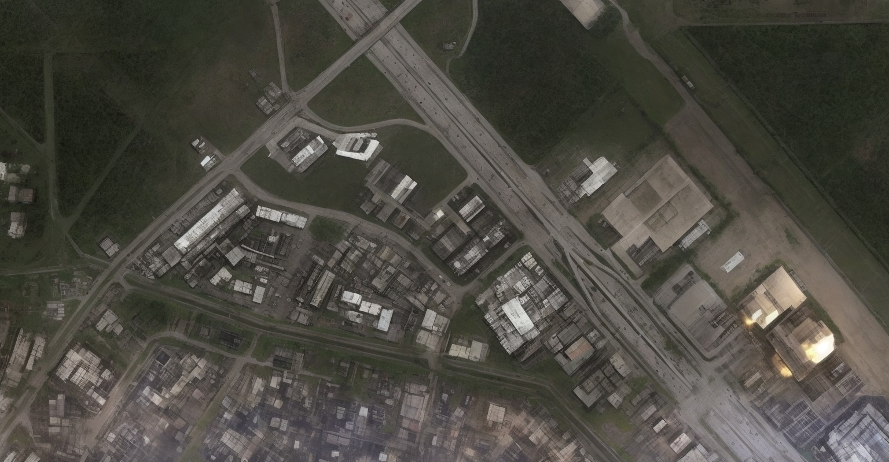

<geotag 
  latitude=29.597558276275628
  longitude=-95.19936322527144
  icon="LARGE_SETTLEMENT"
  name="Scarsdale"
/>

|                                         |                    |
|-----------------------------------------|--------------------|
| **Population**                          | 70                 |
| **Defenses**                            | Strong             |
| **Food Supply**                         | Abundant           |
| **Denizen Outlook**                     | Friendly           |
| **Faction Affiliation**                 | Lone Star Republic |
| **Starting Settlement Reputation Rank** | Neutral (2)        |

- Found at the lower intersection of I-45 and the Sam Houston Tollway, Scarsdale was a small non-descript settlement before the Great War, but its strategic location on the way to the coast has enabled it to grow into a serious trading hub.
- Scarsdale is a member settlement of the Lone Star Republic.
- It is governed by a town council, who are elected by the settlement's residents. The council is responsible for managing the settlement's trade agreements and ensuring that the settlement's needs are met.
- Scarsdale occasionally has to fend off attacks from raiders and other hostile factions, but the settlement's defenses are strong enough to repel most attacks. 
- The residents keep an eye on the ghouls that inhabit the nearby Ellington Field ruins, but they have not had any major conflicts with them.

### Establishments
- <geotag name="Pipes Bar and Grill" latitude=29.597067373785425  longitude=-95.19903809659499  icon="FOOD" zoom=TOWN />: A popular bar and restaurant where traders and travelers gather to exchange information and stories. The bar is owned by Lena "Pipes" Santos.
- <geotag name="Scarsdale Market" latitude=29.59671287345751  longitude=-95.19940287700209  icon="WAREHOUSE" zoom=TOWN />: A bustling marketplace where traders from various factions converge to exchange goods and information. The market is overseen by the settlement's council of traders, with Trader Councilor Jenna Redwood overseeing day-to-day operations.
- <geotag name="Medical Clinic" latitude=29.5970860316629  longitude=-95.20082981212396  icon="HOSPITAL" zoom=TOWN />: A medical clinic run by Doctor Abigail Sterling who treats the settlement's residents and visitors. 
- <geotag name="Scarsdale Outfitters" latitude=29.59741954067207  longitude=-95.2002397261919 icon="WAREHOUSE" zoom=TOWN />: A general store that sells a variety of goods, including weapons, armor, and survival supplies. The store is run by a merchant Elias Cross who has connections with various factions.
- <geotag name="Scarsdale Caravan Company" latitude=29.59852034569547 longitude= -95.19877524014575 icon="CARAVAN" zoom=TOWN />: A caravan company that provides transportation and security for traders and travelers. The company is run by the Caravan Master Barrett Stone who oversees the settlement's caravan operations.
- <geotag name="Great Scott Motel" latitude=29.59715366647117 longitude= -95.19786865354577 icon="INN" zoom=TOWN />: A motel that provides lodging for travelers and traders passing through the settlement. The motel is run by its manager Lily Harper who oversees the settlement's hospitality operations.
- <geotag name="Apartment Complexes" latitude=29.594606835950035 longitude=-95.19829244255006 icon="SETTLEMENT" zoom=TOWN />: Scarsdale is the home of several apartment complexes, where residents and visitors can find shelter and rest. The apartment complexes are managed by a superintendent Felix Mitchell who oversees the settlement's housing operations.
- <geotag name="Houses" latitude=29.593925804421225 longitude=-95.20151109327057 icon="SETTLEMENT" zoom=TOWN />: On the southern edge of the settlement, there are several houses where wealthier residents live.
- <geotag name="Red Rocket" latitude=29.59794429032526 longitude=-95.19960136043305 icon="ROCKET" zoom=TOWN />: A Red Rocket gas station that provides fuel and vehicle maintenance services for travelers and traders passing through the settlement. The gas station is run by a mechanic named Red who oversees the settlement's vehicle maintenance operations.
- <geotag name="Brahmin Camp Ground" latitude=29.595649365003776 longitude= -95.1932498894829 icon="TRAILER_PARK" zoom=TOWN />: A camp ground where traders and travelers can rest and tend to their brahmin. The camp ground is run by a rancher named John who oversees the settlement's brahmin operations.
- <geotag name="Old Church" latitude=29.593942130561622 longitude= -95.19027800188758 icon="CHURCH" zoom=TOWN />: A large, open auditorium/church that serves as a weekly gathering place for the more pious residents of Scarsdale and nearby settlements. Due to the large size of the auditorium, it is also used for town meetings and other large gatherings.

### NPCs
- Rumormonger Wilkins: A chatty and inquisitive local resident. Wilkins can be found at any of the settlement's gathering area, but most frequently at Pipes, eager to share information, for those that will buy him a drink.
- Lena "Pipes" Santos: A bar owner who has her ears to the ground. Players can find her establishment near the market area. She is a former caravan guard who settled in Scarsdale.
- Trader Councilor Jenna Redwood: A seasoned trader and shrewd negotiator, Jenna Redwood leads the town council and is well-respected in Scarsdale's bustling marketplace.
- Doctor Abigail Sterling: Dr. Sterling is a compassionate and skilled physician who has dedicated her life to healing the settlement's residents and visitors.
- Elias Cross: Elias Cross, the merchant of Scarsdale Outfitters, is known for his resourcefulness and ability to source rare and valuable items for his store.
- Barrett Stone: Barrett Stone is a grizzled caravan master who ensures the safety of Scarsdale's caravans, navigating the wasteland's dangers with expertise.
- Lily Harper: Lily Harper, the motel manager, offers travelers a warm and comfortable place to rest, making her a welcoming presence in the settlement.
- Felix Mitchel: Felix Mitchel, the superintendent of the apartment complexes, was originally a handyman before the Great War. He became a ghoul after the bombs fell, and simply continued to do what he did before the war, fixing things and keeping the apartment complexes in good shape. He is a friendly and helpful ghoul, who is well-liked by the settlement's residents.
- Red: Red is a mechanic who runs the Red Rocket gas station. He is a former caravan guard who settled in Scarsdale.
- John: John is a rancher who runs the brahmin camp ground. He is a former caravan guard who settled in Scarsdale.

### Quests
#### Side Quest: Lost Caravan
!!! info ""

    This quest becomes available so long as the players' Scarsdale settlement reputation is at least Cautious (rank 1).
    
    **Add 1 AP per PC to the GM's pool when the quest begins.**

*Quest Giver: Caravan Master Barrett Stone*

One of Scarsdale's caravans has gone missing in the wasteland, and Caravan Master Barrett Stone is desperate to locate them. Players are tasked with unraveling the mystery of the caravan's disappearance, following a trail of clues, encounters with hostile factions, and potentially uncovering a new and dangerous threat to the settlement. The fate of the missing caravan, as well as the future of Scarsdale's trade routes, rests in the players' hands.

##### The Search for Quinn

- Into the Wastes: One of Scarsdale's caravans, run by Desmond Quinn has gone missing and is 36 hours late. The Caravan Master Barrett Stone tasks the players with finding Quinn's Caravan. The caravan was supposed to be delivering a shipment of weapons from the Brotherhood of Steel in Richmond. Along the way, they encounter various challenges such as mutated creatures, hostile raider groups, and environmental hazards.
- Encounter with Coral Stride: Along the way, the players meet Bartholomew "Coral Stride" Kingsley, a seasoned caravaner from [Harbor's Rest](#harbors-rest-formerly-baytown). He shares the urgency of Quinn's disappearance and informs the players about the Brotherhood's checkpoint. Coral Stride provides them with information directing the players toward <geotag name="Brotherhood Checkpoint Golf" latitude=29.661168240975183 longitude=-95.55782020998892 icon="BROTHERHOOD_OF_STEEL"/>, where the Brotherhood of Steel is stopping all travelers to find Desmond Quinn.
- Brotherhood Checkpoint Golf: Arriving at the Brotherhood checkpoint, the players witness the strict security measures in place. Scribe Duvall and Knight Chen interrogate them about their purpose, but eventually, they are directed to meet with Elder Talon, who has more information on Quinn's alleged betrayal. The players have the opportunity to gather clues and decide whether to trust the Brotherhood's account.

##### Unraveling Secrets

- The Brotherhood's Accusations: Elder Talon reveals the Brotherhood's version of events, accusing Quinn of theft and treason. The players can investigate the evidence and interview witnesses at the checkpoint to uncover inconsistencies or alternative motives.
- Lone Star Republic Involvement: Through a hidden contact, the players receive a message from Lone Star Republic operatives revealing Quinn's true allegiance as an undercover operative. They learn about Quinn's mission and the potential fallout if the Brotherhood discovers the Lone Star Republic's plans. The players must now balance their loyalty to the Brotherhood against their duty to uncover the truth.
- Quinn's Trail: Following leads from the Brotherhood checkpoint and information from Lone Star Republic contacts, the players track Quinn's movements to a <geotag name="Hidden Missile Silo" latitude=29.647514630311672 longitude=-95.58483828061671 icon="BUNKER"/> in the wasteland. They discover that Quinn has been trying to sabotage the missile silo's operations, but he has been detected by Brotherhood Patrols. The silo was clearly built to protect some kind of experimental nuclear weapon, but Quinn claims that it was already missing when he arrived. When he tripped the Brotherhood detectors, the Brotherhood Patrol found the evidence of the weapon and assumed that he had taken it. Quinn managed to escape. The players must now decide whether to help Quinn or turn him over to the Brotherhood.

##### The Missile Silo Revelation

- The Hidden Silo: The players eventually discover the hidden missile silo that Quinn had stumbled upon. The players must explore the depths of the silo, facing mutated creatures, automated defenses, and solving puzzles left by the pre-war scientists.
- Unveiling the Conspiracy: As the players delve deeper, they uncover that some unknown faction has a plan to use the experimental nuclear weapon to destabilize the region and seize control of valuable resources, including the Lone Star Republic's spaceport. Quinn, realizing the magnitude of the threat, has been trying to sabotage their efforts while avoiding detection.
  - (This unknown faction is the Enclave remnant within the Oil Barons. This bunker had been used as an experimental lab since before the Great War and has been maintained (though is not actively used all the time) since. The Oil Barons Enclave Remnant had sprung into action after the emergence of the Spaceport Survivors and their Enclave Remnant. See [The Enclave](enclave.md) for more information.)
- Showdown at the Silo: The players must confront Quinn, who is obsessed with the need to prevent the catastrophic plans of the rogue faction. The confrontation leads to a tense negotiation or a climactic battle.

#### Side Quest: The Ellington Field Dilemma
!!! info ""

    This quest becomes available so long as the players' Scarsdale settlement reputation is at least Trusting (rank 4).
    
    **Add 2 AP per PC to the GM's pool when the quest begins.**

*Quest Giver: Trader Councilor Jenna Redwood*

Trader Councilor Jenna Redwood is troubled by persistent rumors circulating among the residents of Scarsdale. Whispers of a hidden settlement of sentient ghouls in the nearby Ellington Field have reached her ears. Given the settlement's history of feral ghoul attacks, the revelation of sentient ghouls residing in the area is both surprising and potentially game-changing for Scarsdale's survival. Jenna calls upon the players to investigate these claims and explore the possibility of forming an alliance with the ghouls to bolster the settlement's defenses against the frequent feral raids. She tasks the players to find evidence of the sentient ghouls' existence, and if possible establish contact with them.

Potential outcomes for this quest might include:

- The players discover some evidence of the sentient ghouls' existence, but are unable to establish contact with them.
- The players establish contact with the sentient ghouls, but are unable to convince them to form an alliance with Scarsdale.
- The players establish contact with the sentient ghouls and convince them to form an alliance with Scarsdale if Scarsdale agrees to help the sentient ghouls clear out the feral ghouls in Ellington Field.
- With the help of the Lone Star Republic's Texas Rangers, the players participate in a raid on the feral ghoul nest in Ellington Field, clearing the area of the threat and allowing the sentient ghouls to establish a stronger settlement there.

#### Side Quest: Mysterious Motel Heist
!!! info ""

    This quest becomes available so long as the players' Scarsdale settlement reputation is at least Cautious (rank 1).
    
    **Add 1 AP per PC to the GM's pool when the quest begins.**

*Quest Giver: Lily Harper (Motel Manager)*

The settlement's motel has been targeted by a group of cunning thieves who've made off with a valuable collection of pre-war memorabilia belonging to Lily Harper. Players are enlisted to investigate the crime scene, question potential witnesses, and track down the thieves who have scattered into the wasteland. As they delve deeper into the mystery, players may uncover a surprising motive behind the theft and a moral dilemma regarding whether to return the stolen items or claim them for the settlement.

#### Side Quest: Medicinal Shortage
!!! info ""

    This quest becomes available so long as the players' Scarsdale settlement reputation is at least Cautious (rank 1).
    
    **Add 1 AP per PC to the GM's pool when the quest begins.**

*Quest Giver: Doctor Abigail Sterling*

Doctor Sterling, the settlement's physician, is running critically low on essential medical supplies needed to treat the injured and sick residents. The players are tasked with venturing into the dangerous wasteland to locate a hidden cache of medical goods, navigating treacherous territory and potentially encountering rival factions or mutated creatures along the way. Their success will determine the health and well-being of the Scarsdale community.

## Clear Lake Refuge (formerly Clear Lake)

<geotag 
  latitude=29.60732196391364
  longitude=-95.11601795269615
  icon="FARM"
  name="Clear Lake Refuge"
/>

- Clear Lake Refuge is a hidden community of survivors who have chosen to live off the land and maintain a sustainable
  lifestyle. They are wary of the larger factions and prefer to remain self-reliant.
- The settlement's origins can be traced back to a group of ecologists and nature enthusiasts who saw an opportunity to
  return to a simpler way of life amidst the post-apocalyptic chaos. They've developed advanced permaculture techniques
  and live in harmony with the natural environment.
- Clear Lake Refuge values isolation and self-sufficiency, and its members are known for their commitment to preserving
  the beauty of Clear Lake and its surroundings.

## Highway Hub (formerly Greenspoint)

<geotag 
  latitude=29.948867738881624
  longitude=-95.41319652659553
  icon="WAREHOUSE"
  name="Highway Hub"
/>

- The Highway Hub is a makeshift trading post located along the remnants of Interstate 45, a critical route for
  travelers and caravans moving goods between Houston and other regions.
- It was established by a resourceful group of survivors who recognized the strategic importance of this location for
  trade and information exchange. Over time, it has grown into a bustling hub of activity.
- The settlement operates as a neutral ground where different factions and traders come to negotiate, barter, and form
  alliances. It is governed by a council of experienced traders who maintain order and ensure fair trade practices.

## San Jacinto Stronghold (San Jacinto Monument)

<geotag 
  latitude=29.749687116950135
  longitude=-95.0805676912006
  icon="MONUMENT"
  name="San Jacinto Stronghold"
/>

- The San Jacinto Stronghold is a unique settlement that has taken refuge in the towering San Jacinto Monument, a
  structure once built to commemorate a historic battle.
- The residents are descendants of military personnel and historians who saw the monument's height as a strategic
  advantage. They've fortified the structure, using it as a lookout post to spot threats from a distance.
- The Stronghold's inhabitants are known for their sharpshooting skills and their commitment to protecting their
  territory. They hold a deep reverence for the monument and its historical significance, seeing it as a symbol of their
  resilience and determination.
- These settlements bring additional layers of depth and diversity to the Gulf Coast Wasteland, showcasing the
  creativity and adaptability of survivors in the post-apocalyptic world.

## Harvest Haven (formerly Conroe)

<geotag 
  latitude=30.333103427645987
  longitude=-95.47711786182347
  icon="FARM"
  name="Harvest Haven"
/>

- Harvest Haven, formerly known as Conroe, is a bustling agricultural settlement located to the north of Houston along
  Interstate 45. The town's rebirth was driven by a group of survivors who recognized the fertile lands surrounding
  Conroe as a valuable resource in the post-apocalyptic world.
- The residents of Harvest Haven have transformed the region into a lush farming community, cultivating fields of crops,
  orchards, and gardens. Irrigation systems, scavenged from the remnants of the past, provide a steady supply of water
  to sustain their agricultural endeavors.
- The name "Harvest Haven" reflects the town's dedication to farming and its role as a major supplier of food to the
  Gulf Coast Wasteland. The town also features a bustling marketplace where traders from neighboring settlements gather
  to exchange goods, making it a crucial economic center in the region.
- Harvest Haven is governed by a council of farmers and traders who oversee the town's operations and ensure its
  continued prosperity. They are known for their commitment to preserving the town's agricultural heritage and
  maintaining its self-sufficiency.
- Member of the Lone Star Republic

## Scholar's Summit (formerly Huntsville)

<geotag 
  latitude=30.71356276127107
  longitude=-95.5474691387572
  icon="CLOCK_TOWER"
  name="Scholar's Summit"
/>

- Scholar's Summit, formerly known as Huntsville, stands as a beacon of knowledge and education in the post-apocalyptic
  world. The town's transformation began with a group of educators, historians, and intellectuals who recognized the
  importance of preserving human knowledge and culture.
- The town is situated to the north of Harvest Haven and is known for its makeshift "Wasteland University." Here,
  survivors share and pass down knowledge in various fields, ranging from science and literature to survival skills and
  craftsmanship.
- Scholar's Summit takes its name from the scholarly pursuits of its residents, who have scavenged books, documents, and
  artifacts from the pre-war era to create a unique repository of knowledge. The town's library is a prized possession,
  and its inhabitants are dedicated to the pursuit of learning and the preservation of history.
- The town's motto, "Ignorance is the Only Enemy," reflects its commitment to education and the belief that knowledge is
  the key to rebuilding and understanding the world.
- Scholar's Summit is also surrounded by a large forest, the remains of the Sam Houston National Forest. The forest is
  home to a variety of wildlife, including mutated creatures and rare plants, making it a valuable resource for the
  town's residents.
- South of Scholar's Summit is a prison operated by the Lone Star Republic. The prison houses dangerous criminals and is
  guarded by a contingent of Texas Rangers.

## Petroclave (formerly Beaumont)

<geotag 
  latitude=30.085242078473243
  longitude=-94.10136486070702
  icon=""
  name="Petroclave"
/>

- Following the Great War, Beaumont, once a thriving center of the oil industry, experienced a significant decline in
  influence and population due to the widespread devastation caused by the nuclear conflict. Much of its vital oil
  infrastructure was severely damaged, rendering it inoperable.
- In the post-apocalyptic era, Beaumont has become a shadow of its former self. Its population is smaller, and the city
  now relies on surviving oil reserves and available resources to sustain itself. While its pre-war importance is still
  recognized, its impact on the region has diminished.
- Beaumont is a crucial part of the Lone Star Republic, playing a vital role in the faction's energy production and
  resource acquisition efforts. The Republic has incorporated Beaumont into its territory, leveraging its remaining oil
  reserves to bolster its own strength and contribute to the region's stability.

## Ellington Field

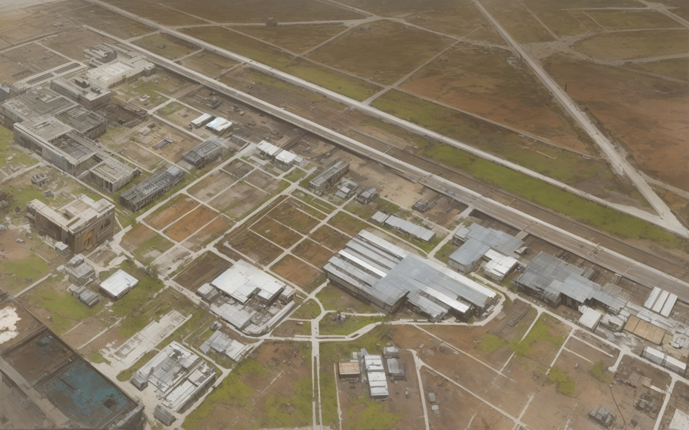

<geotag 
  latitude=29.61973374830343
  longitude=-95.17395740312563
  icon="MILITARY"
  name="Ellington Field"
/>

Ellington Field is a significant location in the Gulf Coast Wasteland, especially due to its historical and strategic
importance. Here's more information about Ellington Field and its role in the post-apocalyptic setting:

### Pre-War History

Ellington Field, located to the southeast of Houston, was originally an active military installation used by the United
States military and NASA. It served as a hub for aerospace and aviation activities.
Before the Great War, the field was home to various military units, aviation schools, and research facilities. It played
a crucial role in supporting space exploration missions, as well as military training and operations.

Some members of the Enclave, a secretive pre-war organization that had infiltrated the US Government and Military, were 
stationed at Ellington Field. It was here that they conducted covert operations including the sabotage of the Vault-Tec 
mining facility on the Moon prior to the Battle of the Sea of Tranquility.

### Post-Apocalyptic Transformation

In the aftermath of the Great War, Ellington Field experienced a significant transformation. The once-thriving military
and aerospace hub fell into disrepair and disuse.
The field's runways and hangars, while still standing, have deteriorated over the years, and many of its buildings have
become shelter for survivors, scavengers, or even small factions.
While some of the old military equipment and aircraft may remain in various states of disrepair, they are often
cannibalized for spare parts or repurposed for makeshift defenses.

### Ghoul Farm

In the years leading up to the Great War, Ellington Field, located in Houston, Texas, served as a vital joint military airbase, housing various units from the Army, Air Force, and even civilian contractors. Among the personnel stationed there were a group of soldiers and support staff, including Corporal Riley Mitchell, Private Carmen Rodriguez, Specialist Jackson "Jack" Harper, Private First Class Emily "Skye" Thompson, and Sergeant Marcus "Quill" Williams.

When the bombs fell, chaos erupted, and the once bustling military base became a scene of devastation. The radiation unleashed by the nuclear blasts had a profound and unexpected effect on the surviving personnel stationed at Ellington Field. Instead of perishing in the initial blasts, they were transformed into ghouls—immortal beings with rotting flesh, sustained by radiation but cursed with eternal life.

For the first few decades after the Great War, the ghoul survivors of Ellington Field struggled to come to terms with their new existence. They witnessed the world they once knew crumble into ruin, overrun by mutated creatures, and plagued by the harsh realities of post-apocalyptic life. Despite their shared bond as ghouls, they found it challenging to integrate into the new world, often facing discrimination and hostility from humans and other wasteland denizens.

Seeking a semblance of normalcy and purpose in their eternal existence, the group banded together and decided to make use of the land they once called home. Over the course of two hundred years, they gradually transformed a portion of Ellington Field into a feral ghoul farm—a macabre endeavor born out of necessity and survival instincts.

Utilizing their military training and collective skills, they established a system for capturing and corralling feral ghouls that roamed the surrounding wasteland. Through trial and error, they learned to domesticate and manage these creatures, turning them into a renewable resource for sustenance and protection. The feral ghoul farm provided them with a means of survival in the harsh post-apocalyptic world, supplying them with food, labor, and even a form of defense against would-be attackers.

Despite their isolation and the grotesque nature of their occupation, the ghoul survivors of Ellington Field remained fiercely loyal to one another. They found solace and camaraderie in their shared struggles and victories, forging bonds that transcended their decaying flesh and immortal souls. As the centuries passed, they became known as the "Ghoulish Guardians of Ellington," a testament to their resilience and adaptability in the face of unimaginable adversity.

Today, the feral ghoul farm at Ellington Field stands as a grim reminder of the world that was lost and the sacrifices made by those who survived. Though they may be shunned by society and haunted by their past, the Ghoulish Guardians continue to persevere, determined to carve out a place for themselves in the unforgiving wasteland they now call home.

### Characters

- Corporal Riley Mitchell:
  - A former flight mechanic turned ghoul, Riley Mitchell possesses a keen mind for machinery and a knack for keeping things running smoothly. Despite the decay of his flesh, he remains as sharp-witted and resourceful as ever, using his technical expertise to maintain the feral ghoul farm and keep his fellow survivors safe.
- Private Carmen Rodriguez:
  - Once a military police officer tasked with maintaining order and security, Carmen Rodriguez now channels her combat skills and sense of justice into protecting her ghoul comrades. Her unwavering loyalty and determination make her a formidable ally and a force to be reckoned with in the wasteland.
- Specialist Jackson "Jack" Harper:
  - As a former communications specialist, Jack Harper's knowledge of technology and knack for deciphering codes make him an invaluable asset to the group. Despite the decay of his body, his mind remains sharp, and he uses his skills to maintain communication with the outside world and gather valuable intelligence.
- Private First Class Emily "Skye" Thompson:
  - Skye Thompson, once an aerial reconnaissance scout, now navigates the wasteland with the same precision and determination she displayed in the skies. Her keen observation skills and marksmanship make her an expert hunter and scout, essential for securing resources and defending the feral ghoul farm from threats.
- Sergeant Marcus "Quill" Williams:
  - Marcus Williams, the former supply quartermaster, brings order and efficiency to the group, managing resources and overseeing the day-to-day operations of the feral ghoul farm. His strategic thinking and negotiation skills ensure the survival of the group in the harsh post-apocalyptic wasteland.

## Houston International Airport (IAH)

<geotag 
  latitude=29.99328232450453
  longitude=-95.3418400798264
  icon="AIRPORT"
  name="Houston International Airport"
/>

Remains of an airport, used by the Lone Star Republic as a base of operations for their military.

## Tomball

<geotag 
  latitude=30.090750800484926
  longitude=-95.63690501740697
  icon=""
  name="Tomball"
/>

- Tomball's pre-war suburban charm has given way to a resilient survivor's haven. The once orderly streets are now lined
  with makeshift shelters and fortified structures, constructed from the remnants of the town's original buildings and
  scavenged materials.
- Residents of Tomball have organized themselves into a tight-knit community, often referring to their settlement as
  "Tomball Stronghold." The survivors have adopted a communal lifestyle, sharing resources and responsibilities to
  ensure their collective survival.
- Tomball's central square, once a gathering place for community events, now serves as a bustling marketplace where
  residents barter for necessities and trade surplus goods. Salvaged pre-war technology, weapons, and tools are often up
  for trade.
- The town has its own water source, drawing from nearby groundwater wells. This self-sufficiency in water supply has
  been crucial for Tomball's survival, allowing the community to resist attempts at control or exploitation by outside
  factions.
- Tomball Stronghold maintains a defensive perimeter to protect against threats, including the occasional raider gang or
  wildlife incursion. Residents are skilled in marksmanship and defense, ensuring their ability to repel any hostile
  forces.
- The settlement's location northwest of Houston places it within the sphere of influence of the Lone Star Republic, who
  have attempted to assert their control over Tomball Stronghold. However, the fiercely independent residents of Tomball
  have resisted such encroachments, leading to occasional tensions.

## Humble Haven (formerly Humble, pronounced with a silent H)

<geotag 
  latitude=30.006845093386108
  longitude=-95.26569366657448
  icon=""
  name="Humble Haven"
/>

- Humble's pre-war identity as a quiet suburban town has been reshaped by the harsh realities of the post-apocalyptic
  world. Its streets, once lined with tidy houses and local businesses, now feature a mix of improvised shelters,
  scavenged materials, and fortifications.
- Survivors of the Great War have banded together to form a close-knit community within the remnants of Humble. They
  refer to their settlement as "Humble Haven" and have built a shared sense of purpose based on mutual support and
  cooperation.
- The town's central square, once a gathering spot for community events and festivals, has been repurposed into a
  bustling marketplace. Here, residents and traders exchange goods, share stories, and negotiate trade deals, creating a
  sense of unity in the face of adversity.
- Humble Haven relies on a network of water wells and rain collection systems to provide a sustainable source of
  freshwater. This self-sufficiency has allowed the community to maintain a degree of independence and resist attempts
  at control by outside factions.
- The settlement maintains a vigilant watch against potential threats, as the region is home to mutated creatures and
  the occasional raider gang. Residents have developed defensive skills and strategies to safeguard their home.
- Positioned northeast of Houston, Humble Haven falls within the influence sphere of the Lone Star Republic. While the
  Republic has extended its protective umbrella over the settlement, tensions occasionally arise as Humble Haven seeks
  to maintain its autonomy.
- Because of its proximity with the International Airport, Humble Haven has become a strategic location for the Lone
  Star Republic. The Republic has established a military base at the airport, using it as a staging area for operations
  and a hub for intelligence gathering.

## Navasota Outpost

<geotag 
  latitude=30.388792479443126
  longitude=-96.08814721515886
  icon=""
  name="Navasota Outpost"
/>

- Navasota's former small-town charm has given way to a thriving post-apocalyptic settlement known as "Navasota
  Outpost." The town's streets, once quiet and lined with historic buildings, are now bustling with activity.
- The survivors of the Great War have reorganized themselves into a tight-knit community. Navasota Outpost has become a
  center of trade and commerce, attracting travelers, merchants, and scavengers from across the Gulf Coast Wasteland.
- The town's historic downtown area has been revitalized and repurposed into a marketplace. Here, traders set up stalls
  to exchange goods, while local artisans and craftsmen display their wares, from pre-war relics to homemade weapons and
  armor.
- Navasota Outpost benefits from its location along a trade route that connects it to both the Lone Star Republic and
  the Oil Barons' territories. This strategic position has allowed the settlement to prosper through trade agreements
  with various factions.
- Navasota's access to freshwater from nearby sources, such as the Navasota River, ensures a stable supply of drinking
  water and supports limited agriculture, contributing to the settlement's self-sufficiency.
- Despite the prosperity, Navasota Outpost remains vigilant against potential threats, such as raider bands and hostile
  creatures. The settlement has established a perimeter defense and a volunteer militia to maintain security.

## Richmond

<geotag 
  latitude=29.5818349078936
  longitude=-95.7597091077604
  icon="BROTHERHOOD_OF_STEEL"
  name="Richmond"
/>

## Minor Settlements

- <geotag 
  latitude=29.329554564080837
  longitude=-94.93345112094737
  icon="MARINA"
  name="Bayou Vista"
/>: NLTC maintains a well-protected but small marina at the Bayou Vista, where their protected ships land. Although they do not use warships, the Galveston Pirates usually leave them alone, after a few early, failed attempts to raid their ships. The NLTC has a small but well-armed security force, and they are not afraid to use it.
- <geotag 
  latitude=28.945390562803066
  longitude=-95.34654850883261
  icon=""
  name="Portside Shantytown"
/>: Nestled along the coast, Portside Shantytown is a collection of ramshackle huts and makeshift structures inhabited by survivors who have chosen to live near the sea. They are primarily fisherfolk and salvagers who rely on the Gulf's bounty for survival. The settlement maintains a tense relationship with the Galveston Pirates, who occasionally raid the coastal community.
- <geotag 
  latitude=29.756808906476053
  longitude=-95.17680192109725
  icon="FACTORY"
  name="Refugee Camp Alpha"
/>: Situated in the ruins of a pre-war industrial complex on the outskirts of Houston, Refugee Camp Alpha is a temporary haven for displaced survivors. It's a place where people from various backgrounds gather for safety and support. Life is challenging in the camp, as resources are scarce, but the sense of community remains
  strong.
- <geotag 
  latitude=29.554091000183266
  longitude=-95.6632385089244
  icon="FARM"
  name="Greenhaven Orchard"
/>: In the suburbs to the west of Houston, Greenhaven Orchard is an oasis of sorts. This small settlement has cultivated a thriving orchard and vegetable garden. They trade their produce with larger factions, making them a vital source of fresh food in the wasteland.
- <geotag 
  latitude=29.54212556868445
  longitude=-95.01965359090539
  icon="MARINA"
  name="Sunset Trading Post, formerly Kemah"
/>: Located along the remnants of State Highway 146, Sunset Trading Post is a crucial rest stop for caravans traveling between Houston and Galveston. It's a place where merchants and travelers can resupply, trade, and
  exchange information. The Galveston Pirates keep a watchful eye on this strategic location.
- <geotag 
  latitude=30.2117556488417
  longitude=-95.7541253707608
  icon=""
  name="Whitetail Ranch, formerly Magnolia"
/>: Deep in the wooded regions to the north of Houston, Whitetail Ranch is a rustic community of hunters and trappers. They have adapted to the wilderness and have found ways to survive by trading animal pelts and meat with
  other settlements.
- <geotag 
  latitude=30.393996346473614
  longitude=-95.63579078227842
  icon=""
  name="Marinaville Resort"
/>: This former luxury resort near Lake Conroe has been repurposed by a group of survivors into a functional community. Its proximity to the water provides easy access to fish and freshwater, making it a sought-after location. 
- <geotag 
  latitude=29.49440263042049
  longitude=-94.92227210154844
  icon=""
  name="Bayshore Hamlet, formerly San Leon"
/>: Situated along the coastal regions near Galveston Bay, Bayshore Hamlet consists of a few
  ramshackle buildings and fishing docks. Its inhabitants rely on fishing and scavenging along the bay to survive. They
  have an uneasy relationship with the Galveston Pirates, who often demand tribute.
- <geotag 
  latitude=29.690553779988246
  longitude=-95.20304635178483
  icon="DRILL"
  name="Oilfield Outpost, formerly Pasadena"
/>: This small outpost is built around a pre-war oil drilling facility. Survivors have tapped
  into the facility's remaining reserves to provide fuel for generators and trade with nearby settlements. The Oilfield Outpost plays a critical role in supporting the Lone Star Republic's energy needs.
- <geotag 
  latitude=29.367277175045796
  longitude=-94.7667079031319
  icon="LIGHT"
  name="Lighthouse Landing, formerly Point Bolivar Lighthouse"
/>: Located at the end of a desolate peninsula, Lighthouse Landing is centered arounda still-functioning lighthouse. Its primary purpose is to guide traders and travelers through treacherous coastal waters. The settlement has limited resources but is a beacon of hope for those navigating the Gulf's dangerous
  currents.
- <geotag 
  latitude=30.71058036209488
  longitude=-94.93177601452567
  icon="TREE"
  name="Sawmill Sanctuary, formerly Livingston"
/>: Deep in the Sam Houston National Forest, Sawmill Sanctuary has repurposed a pre-war
  sawmill to provide lumber and building materials to other settlements. The community is self-sufficient, relying on the forest's resources for survival.
- <geotag 
  latitude=29.694219313979627
  longitude=-95.04040096980611
  icon="FACTORY"
  name="Power Plant Perch, formerly La Porte"
/>: Nestled near the remains of a pre-war power plant, this settlement is highly sought after due to its access to electricity. Its inhabitants have repaired and maintained the plant's generators, providing valuable power to neighboring settlements in exchange for resources and protection.
- <geotag 
  latitude=29.35310365705205
  longitude=-95.46338712216787
  icon="FARM"
  name="Rancher's Retreat, formerly Rosharon"
/>: This small ranching community relies on livestock and agriculture to sustain itself. Rancher's Retreat is known for its cattle herds and horse breeding. They trade surplus livestock and leather goods with nearby settlements.
- <geotag 
  latitude=29.891571087722877
  longitude=-95.2635859137306
  icon="WATER_TREATMENT"
  name="Waste Recycling Center"
/>: Located near the outskirts of Houston, this settlement has repurposed a pre-war waste recycling facility to salvage and repurpose materials. It serves as a vital resource hub for scavengers and traders in the area.
- <geotag 
  latitude=29.962182712186213
  longitude=-95.54549376534099
  icon="WAREHOUSE"
  name="Willowbrook"
/>: This settlement is located in the ruins of a pre-war shopping mall. Its inhabitants have repurposed the mall's stores and restaurants into a bustling marketplace. Willowbrook is a popular destination for traders and scavengers looking to barter for goods and supplies.
- <geotag 
  latitude=30.079371713243425
  longitude=-95.42213908803095
  icon=""
  name="Spring"
/>: A minor settlement located in the ruins of a pre-war suburban community. The residents have repurposed the
  neighborhood's houses into shelters and trading posts. Spring is known for its scavenging operations.

## Additional Locations
- <geotag latitude=28.518411059657137 longitude=-80.67816409203829 icon="ROCKET" name="Kennedy Space Center"/>, in Florida, had significant pre-war importance as a hub for space exploration and research. The remnants of the space center hold valuable technology and resources, attracting scavengers and factions seeking to unlock its secrets. The [Costa Concordia](../background.md#sinking-of-the-costa-concordia) was en route from the Kennedy Space Center to the Gulf Coast Wasteland, carrying cargo (including rockets and artifacts) salvaged from the space center.
- <geotag latitude=29.086461187947474 longitude=-94.06750414525914 icon="BOAT" name="Wreckage of the Costa Concordia"/> is the site where the [Costa Concordia](../background.md#sinking-of-the-costa-concordia) sank.