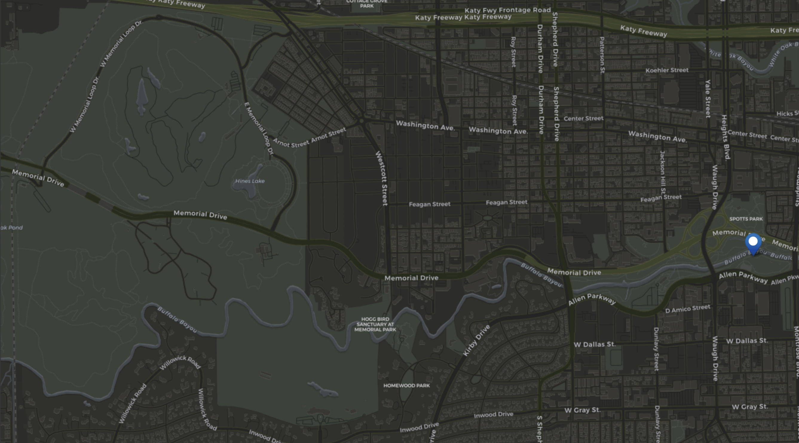

# Quest 1: Lost in the Bayou

## Summary

<!--summary-start-->
- Players wake up in the Bayou Brotherhood's settlement led by Cyrus "Gator" Boudreaux, disoriented and rescued from a shipwreck.
- Gator believes the player's vision of the Sea of Tranquility is significant and connects to the Bayou's cosmic forces.
- Players are tasked with exploring the Bayou, guided by a mystical charm, to find clues related to their vision.
- Strange phenomena in the Bayou, like flickering lights and shadowy figures, can be investigated.
- Players discover the Bayou Medallion, an ancient relic connecting them to their ancestral past and the Sea of Tranquility mission.
- Returning to the Brotherhood with the medallion, Gator explains its significance and tasks players with investigating the Spaceport Survivors.
- Players receive experience points, increased reputation with the Bayou Brotherhood, and the Bayou Medallion with special abilities.
<!--summary-end-->

## Setting

[Buffalo Bayou](../../Background/geography/neighborhoods.md#the-bayous-and-wetlands) 

## Plot

### The Shipwreck Survivor

- The player awakens in the Bayou Brotherhood's settlement, disoriented and unaware of how they arrived. The humid air, sound of wildlife, and the soft glow of swamp lanterns surround them.
- Brotherhood members discovered the player adrift in a shipwreck that had floated into the Bayou. They were brought to safety and nursed back to health.
- The charismatic leader of the Bayou Brotherhood, Cyrus "Gator" Boudreaux, introduces the player to the Brotherhood's way of life and spiritual beliefs.

The quest begins with the player waking up in the Bayou Brotherhood's settlement, disoriented and unaware of how they arrived. A strangely dressed man approaches them and introduces himself as **Cyrus "Gator" Boudreaux**, the leader of the Bayou Brotherhood. He explains that the Brotherhood found the player adrift in a shipwreck that had floated into the Bayou. They were brought to safety and nursed back to health.

Read or paraphase the following introduction:
>You find yourself waking up in a dimly lit room, the air heavy with humidity, and the faint sound of crickets and frogs filling the air. You're disoriented and have no recollection of how you arrived here. As your vision clears, you notice the soft glow of swamp lanterns illuminating the rustic wooden walls and floor.

>You realize you're lying on a makeshift bed, covered in a coarse but comfortable blanket woven from swamp reeds. Nearby, you can hear hushed voices and the gentle movement of people going about their tasks. It becomes apparent that you're not alone in this place.

>A figure approaches you, his silhouette defined by the dim lantern light. He's a tall, wiry man with a broad-brimmed hat and a long coat adorned with various swamp-themed trinkets. This must be Cyrus "Gator" Boudreaux, the charismatic leader of the Bayou Brotherhood.

>Cyrus extends a welcoming hand, his voice calm and soothing, "Well now, stranger, looks like the Bayou done brought y'into its embrace. We found y' adrift in a shipwreck, and we couldn't just leave ya out there to the gators."

>He helps you sit up and offers you a gourd filled with cool, refreshing water. "Name's Cyrus, but 'round these parts, folks call me Gator. The Brotherhood's mighty grateful we could lend ya a hand. You've been out cold for a spell."

>Gator's eyes hold a certain wisdom and kindness, and there's a hint of mystery in his words. "Now, while you're with us, we'll teach you 'bout the Bayou, its secrets, and the cosmic forces that guide our way. It's a bit different from what you might be used to, but I reckon you'll find it mighty enlightening."

After reading the introduction, invite the players to introduce their characters. Gator may ask them some of the following questions:

- By what name should we call ya?
- What were you doing on that ship?
- What do you remember?

### A Vision from the Bayou

- As the player recounts their ordeal and experiences on the Moon, including the strange vision of the Sea of Tranquility, Gator is intrigued and believes it may hold cosmic significance.
- Gator explains the Bayou's mystical connection to the cosmos and suggests that the player's vision might be linked to the Bayou's cosmic message. He believes the player is meant to uncover something important.
- The player is tasked with exploring the Bayou to find clues related to their vision and its connection to the recurring glimpses of the Sea of Tranquility.

If the players do not volunteer information to Gator about their vision of the Moon (from the [Prologue](../prologue.md) quest), prompt them to do so. 

Gator is intrigued and believes the vision may hold cosmic significance. He explains the Bayou's mystical connection to the cosmos and suggests that the player's vision might be linked to the Bayou's cosmic message. He believes the player is meant to uncover something important.

Read or paraphrase the following:

>"That's somethin' right peculiar, no doubt," Gator says, his voice laced with a hint of wonder. "Visions like these, especially tied to a place like the Sea of Tranquility, it can't be mere coincidence. The Bayou, you see, it's got a mystical connection to the cosmos, and visions of such places ain't to be taken lightly."

>He leans in closer, his words carrying a certain weight. "I've seen signs in the stars, and the Bayou's been talkin' to me for a long while now. I believe your vision might be a piece of the puzzle, a cosmic message, perhaps. And you, my friend, might just be the one meant to uncover its truth."

>Gator's enthusiasm is contagious. "Now, here's what we'll do. I'm gonna ask you to explore the Bayou, look for any clues or signs that might be connected to your vision. It won't be an easy task, but with the Bayou's guidance, you might just find what you're lookin' for."

>He reaches into a nearby satchel and hands you a small, intricately carved charm. "Take this with you, it's a piece of the Bayou's magic. It'll guide you, protect you, and help you make sense of the cosmos. When you're ready, head out into the Bayou, and we'll be waitin' for your return."

Gator offers the players a [Bayou Charm](#bayou-charm), an item with a unique ability related to visions and insights. This charm will glow softly when the player is near an object or location of cosmic significance or a clue related to their visions.

Gator tasks the player with exploring the Bayou to find clues related to their vision and its connection to the recurring glimpses of the Sea of Tranquility.

### Echoes of the Past

- The player ventures deeper into the Bayou, guided by their instincts and the echoes of their great-great-grandfather's decision in the vision.
- As they explore, they encounter strange phenomena: unexplained lights, shadowy figures, and eerie sounds echoing through the swamps, which they can choose to investigate and/or engage.
- The player also discovers an ancient relic, a worn medallion engraved with cryptic symbols. It resonates with the visions and provides a connection to the past.

The players must venture deep into the Bayou. The air is thick and humid, full of the chorus of wildlife. Swamp lanterns, left by the Bayou Brethren, illuminate the once-paved path beside the river. Sounds of urban chaos faintly echo in the distance behind them in the direction of Downtown.

The Bayou Outpost (The pin on the east side of the map) rests in the middle of the straight part of the Bayou, just east of the Bat Bridge (where many bats fly in and out from under the bridge at night). There exist a few different trails, the remains of ancient once-paved, running-trails along the river.

As the players travel west, they will eventually pass the Bird Sanctuary, where they will encounter many different types of birds, many of which mutated. Beyond the Bird Sanctuary, the bayou opens up into a large swamp, the flooded remains of an ancient park. Many trails cris-cross the swamp. The players may also encounter rad-gators, mutated alligators, and other mutated swamp creatures. None of these are hostile unless provoked.

Gator's charm will glow softly when the players near significant objects or locations. The charm's glow, however, will disappear if they walk away.

As players walk deeper into the Bayou, strange phenomena manifest around them. Unexplained lights flicker in the distance, shadowy figures move just out of sight, and eerie sounds ripple through the swamps. The players have the choice to investigate these phenomena or continue on their path.

After some time, some of the lights will dance around the players, like will-o'-the-wisps, leading them deeper in the Bayou into the swamp. Following it, they discover an ancient cypress tree with roots that seem to shimmer with an otherworldly energy. As the players the tree, they hear the faignt sounds of mournful singing, echoing through the swamps. As they get closer, they come across a ghostly procession of spirits dressed in clothing from another era. They appear to be reenacting a long-lost ritual.

Amidst the dense underbrush, the players will stumble upon a hidden hollow, where they can find the relic they seek – a worn medallion engraved with cryptic symbols ([Bayou Medallion](#bayou-medallion)). The moment a player touches it, the medallion resonates with their visions, and flashes of the player's great-great-grandfather's decision during the Sea of Tranquility mission appear before them.

### Return to the Brotherhood

- The player returns to the Bayou Brotherhood's settlement, clutching the enigmatic medallion.
- Gator, intrigued by the medallion, explains that it has appeared about once a generation since the bombs fell and Mother Nature reclaimed the Bayou. It is said to hold the key to understanding the Bayou's cosmic significance.
- This quest concludes with the player gaining Gator's trust and the Brotherhood's willingness to support them in exploring the mysteries of the Gulf Coast Wasteland.
- Gator tasks the player with investigating the Spaceport Survivors, whose recent emergence from their Vault is no coincidence. He believes they are connected to the player's visions and the Bayou's cosmic message.

When the players return to the Bayou Outpost, Gator greets them. Several hours have passed, seemingly impossibly. Gator is intrigued by the medallion and explains that it is legendary, having appeared about once a generation since Nature reclaimed the Bayou after the Great War. It is said to hold the key to understanding the Bayou's cosmic significance, and has always revealed itself to individuals who have a role to play in the Bayou's destiny.

Read or paraphrase the following:
> "This here medallion," Gator begins, his voice low and contemplative, "Legends have been passed down through generations in the Brotherhood. About once a generation, it reveals itself to someone who plays a role in the Bayou's destiny. It's said to hold the key to understandin' the cosmic significance of the Bayou. With this in your hands, it seems the Bayou's tryin' to tell you somethin' important."

> Gator's trust in you seems to grow, and he speaks with conviction. "I believe you've got a role to play, a cosmic role. And I reckon it's tied to the Spaceport Survivors, those folks from the Vault who've emerged recently. It's no mere coincidence, I tell ya. They're connected to your visions, to the Bayou's message."

> He pauses for a moment, then continues. "I'm gonna ask a favor of you, friend. Investigate the Spaceport Survivors, find out what they're up to. They might hold the answers we've been seekin'. And with their emergence, it's more important than ever to understand the Bayou's cosmic message."

Gator will give directions to Vault 117, which lies under the Spaceport. He tells them they can follow I-45 south to find it, but warns them to avoid Downtown, which is overrun with raiders and mutated creatures. He also warns them to be careful around the Spaceport Survivors, as they are a secretive bunch and may not take kindly to outsiders.

Gator also welcomes the players to stay with the Brotherhood for as long as they like. He offers them a place to rest and recuperate, as well as access to the Brotherhood's resources. He also offers to teach them about the Bayou's mystical connection to the cosmos and the Brotherhood's spiritual beliefs.

## Quest Rewards:

- Experience points for completing quest objectives.
- Increased reputation with the Bayou Brotherhood.
- The Bayou Medallion, an item with a unique ability related to visions and insights.
- Unlocking access to the Bayou Brotherhood's spiritual knowledge and unique quests.

## Items:

### Bayou Charm

The Bayou Charm is a finely crafted trinket, its appearance a testament to the intricate artistry of the Bayou Brotherhood. It's designed to reflect the natural beauty and mystique of the Bayou, embodying the union between the swamp's essence and cosmic energies.

- Material: The charm is made from a piece of driftwood, smoothed and polished by the gentle, relentless flow of the Bayou's waters. The wood carries a weathered and worn appearance, a testament to its journey through the ever-shifting swamp.

- Carvings: Delicate and intricate carvings adorn the surface of the charm. They depict scenes of swamp life, including cypress trees, alligators, herons, and lily pads, all set against a backdrop of a starry night sky. The connection between the earthly realm and the cosmos is unmistakable in these carvings.

- Centerpiece: At the heart of the charm, a small, polished moonstone is set in a tiny hollow. This moonstone is the source of the charm's mystic power, believed to amplify the connection between the bearer and the cosmic energies of the Bayou.

- Hanging Cord: A supple cord, woven from natural fibers found in the Bayou, is attached to the charm. It's long enough to be worn as a necklace or bracelet, allowing the bearer to carry the charm close to their heart.

- Size: The Bayou Charm is small, fitting comfortably in the palm of your hand. It's designed to be carried with ease, its weight almost imperceptible.

The charm's intricate carvings and the gentle glow of the moonstone create an aura of enchantment. Its presence is a reminder of the Bayou's mystical connection to the cosmos. The charm will glow softly when the player is near an object or location of cosmic significance or a clue related to their visions.

### Bayou Medallion
The Bayou Medallion is an ancient and weathered relic, its appearance reflecting its long history. It is a circular pendant, approximately two inches in diameter, and made of a dark, almost black, metal. The surface of the medallion is covered in intricate and cryptic engravings.

The central design on the medallion is an ornate, celestial pattern that resembles a star chart. It features an array of interconnected stars and celestial bodies, with lines and symbols that seem to represent cosmic constellations. The entire design is surrounded by a ring of similarly mysterious symbols.

Despite its age and exposure to the elements, the medallion carries an aura of otherworldly significance. When held, it feels cool to the touch and seems to vibrate faintly, resonating with the cosmic visions you've experienced. The engravings, though ancient and worn, still appear to be meticulously detailed, hinting at the medallion's importance and its connection to the mysteries of the Bayou and beyond.

Meditating while wearing the Medallion will grant the user a temporary +2 bonus to Perception. The wearer can attempt a high difficulty Perception check to gain a vision of the past (additional characters can assist by meditating nearby). The vision will be related to the Sea of Tranquility mission and will provide a clue related to the player's visions.

## Purpose:
This quest introduces the player to the Bayou Brotherhood, their spiritual connection to the Bayou, and the central mystery of the player's recurring visions. It establishes the player's role in the faction and hints at the deeper connection between the past and present events.