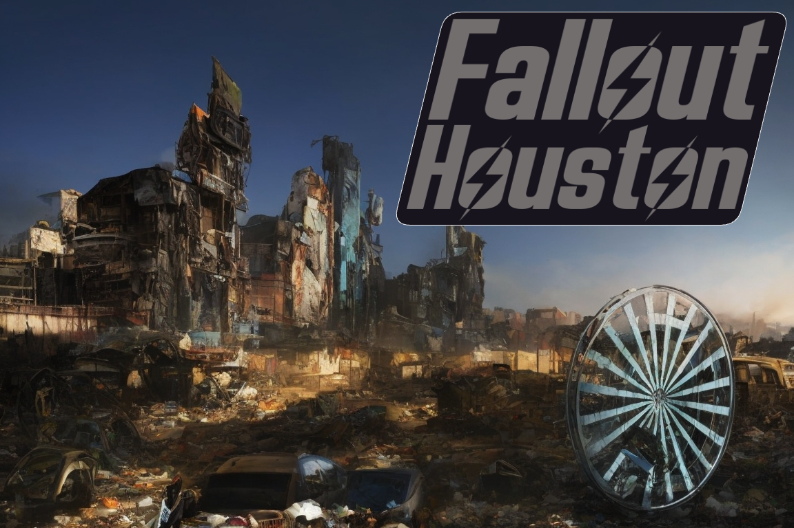

# Fallout: Houston
Welcome to the Gulf Coast Wasteland!

## Overview
Fallout: Houston is a Fallout Tabletop RPG campaign taking place in the Gulf Coast Wasteland, a post-apocalyptic region encompassing Houston and its surrounding areas, including the Galveston coast, the Buffalo Bayou, and some remnants of the Lone Star State. As your players interact with the Lone Star Republic, the Bayou Brotherhood, the Oil Barons, the Galveston Pirates, and the Spaceport Survivors, they will uncover plots and conspiracies that will either guarantee or doom the success of the first manned rocket launch since the Great War.
